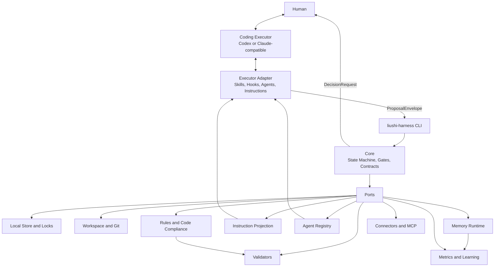
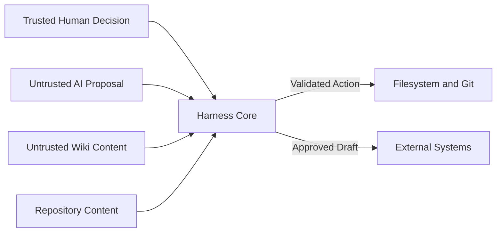

# 01 系统架构

## 1. 架构目标

系统必须同时满足：

- 执行器无关的任务状态、Artifact 和 Gate。
- Codex 深度适配与 Claude-compatible 可移植性。
- AI 判断与确定性写入分离。
- 多仓读取、单仓默认写入和公共层建模。
- 本地优先、可恢复、可审计、无常驻服务。
- 可通过 npm 和安装 Profile 快速接入现有项目。

## 2. 总体架构



Human 与执行器交互，但审批结果必须通过 CLI 转换为 `ApprovalRecord`。聊天中的“可以”本身不是持久化审批，除非适配器将其关联到准确 Artifact Digest，并由 CLI 明确记录。

## 3. 分层与依赖方向

`liushi-harness` 采用模块化单体和 Clean/Hexagonal Architecture。包内按技术职责分层，层内再按业务能力组织，避免把所有文件平铺在 `src/`，也避免首月拆成大量难以独立演进的 npm 子包。

计划包结构摘要：

```text
packages/liushi-harness/
├── src/
│   ├── domain/
│   ├── application/
│   ├── infrastructure/
│   ├── presentation/
│   ├── common/
│   └── bootstrap/
├── integrations/
├── config/
├── generated/
├── tests/
├── scripts/
└── docs/
```

允许的依赖方向：

```text
Presentation -> Application -> Domain -> Common
Infrastructure -> Application Ports + Domain + Common
Bootstrap -> Presentation + Application + Infrastructure
```

`Domain` 和 `Application` 共同构成平台无关 Core。`Infrastructure` 实现 Port，`Presentation` 负责 CLI、Hooks 和 JSON 边界，`Bootstrap` 是唯一 Composition Root。完整目录、文件命名、常量和架构测试规则见 [06 代码库组织与工程约束](./06-codebase-organization.md)。

禁止：

- Domain 或 Application 导入 Codex、Claude Code、CatPaw、文件系统或进程类型。
- Common 仅承载跨模块、语义稳定且无业务判断的基础能力；禁止以 generic `utils.ts` 或 `helpers.ts` 归集代码。
- Adapter 直接写任务状态、审批、知识或 Skill。
- Hook 绕过 CLI 调用 Store。
- Connector 将外部内容直接注入长期知识。
- Validator 修改待验证代码来制造通过结果。
- 在模块边界之外深层导入其他模块内部文件。

## 4. 核心模块职责

### 4.1 CLI

- 唯一规范写入口。
- 参数解析、交互确认和稳定 JSON 输出。
- 校验 Proposal、加载 Policy、执行状态迁移。
- 调用 Port 并写入事件、Snapshot 和 Evidence。
- 提供 `--dry-run`、`--json` 和幂等键。

CLI 命令需要可组合，AI 和 Human 使用同一接口。交互输出可以友好，但 `--json` 输出必须向后兼容并有 Schema Version。

### 4.2 Domain 与 Application Core

- Task State Machine。
- Gate Evaluation。
- Artifact Lifecycle。
- Action Journal 和恢复决策。
- 能力降级与 `WAITING_HUMAN` 路由。

Domain 保存不变量、Value Object、Policy 和领域事件；Application 通过 Use Case 编排 Port。二者除纯函数库、时间/ID 抽象和 Port 外不直接依赖环境。

### 4.3 Contracts

- Zod Runtime Schema。
- 可发布 JSON Schema。
- Artifact Digest 和版本兼容规则。
- ProposalEnvelope、EvidenceRef、ApprovalRecord 等公共类型。

### 4.4 Workspace

- Repository Discovery。
- Workspace Graph 和公共层关系。
- Git Worktree、Diff、Revision 和所有权信息。
- 写入范围检测。

首月多仓用于读取和影响分析。默认一个 Task 只能持有一个仓库写权限；跨仓写入必须通过单独 Gate，并按非原子 Saga 执行。

### 4.5 Scanner

确定性扫描：

- 包管理器、脚本、TypeScript 配置和测试框架。
- Lint、Format、CI 和目录结构。
- Git 历史、CODEOWNERS 和依赖声明。
- 已存在的 AGENTS、Skills、Hooks 和执行器配置。
- ESLint、TypeScript、Architecture Test、项目 Rule 和业务机制入口。

AI 可以基于扫描结果推断项目模式，但必须区分：强制规则、主流模式、遗留模式和未知项。

当前 Project Scanner 切片只提供只读 Project Discovery：

- 输入是 JSON manifest，显式列出一个或多个 Repository 的 `repositoryId`、runtime-only `localRoot` 和 `repositoryRevision`；manifest 不接受预算字段。
- Project Scanner 不使用人工容量或读取预算；全量遍历普通目录和文件，并读取全部被分类的配置文件。规模本身不影响报告完整性，超时和取消属于当前切片尚未建模的运行时编排问题。
- `localRoot` 只传给 FileSystem Adapter，用于解析本机 root；报告、Candidate 和 digest 均不得包含该绝对路径。
- Scanner 只读文件树和配置文件，输出 `ProjectDiscoveryReport`、`ProjectProfileCandidate`、`ArchitectureMechanismCandidate`、Rule Candidate 与依赖边 Candidate。
- JSON/JSONC 和 YAML 由确定性 parser 解析；可执行配置只记录存在、相对路径和内容摘要，不 import、不 eval、不执行脚本。
- 当多个仓库声明同一个 package owner 时，依赖边不能静默选择其一；报告输出稳定排序的 `dependencyAmbiguities`，整体状态为 `incomplete`，等待 Human Review 判定真实所有权。
- Scanner 输出中的 Rules 和 Mechanisms 均保持 Candidate-only，必须 Human Review；Scanner 自身不进行 Profile Promotion。
- 报告状态为 `incomplete` 时 CLI 以 blocked envelope 和退出码 `4` 结束，禁止后续流水线把 Candidate 当作已确认事实。
- `profilePromotionStatus` 固定为 `HumanReviewRequired`；扫描 `complete` 和进程退出码 `0` 只表示只读发现没有阻断诊断。
- Human 通过 `ProjectProfileProposal` 明确仓库 Role，并对每个 Rule/Mechanism Candidate 完整接受或拒绝；G8 始终绑定最新 Proposal Artifact Digest。
- `profile compile` 在 Application 边界严格解析不可信 Report，校验 Workspace、Task、Revision、Candidate 与 Approval 身份后，生成 ProjectProfile Bundle 和 Active ProjectRuleCatalog。它不写业务仓库，也不替代后续 Validator。

### 4.6 Validator

- 项目原生命令编排。
- Schema、Typecheck、Lint、Unit、Integration 和 Playwright。
- 可选 Semgrep、CodeQL 和企业检查。
- 将命令、退出码、版本、Revision 和输出摘要写入 Evidence。

### 4.7 Connector

- Wiki、Issue Tracker、文档系统和其他 MCP 工具访问。
- 认证、权限、来源元数据和结构化返回。
- 默认只读；写入先生成 Draft，再经过 Human Gate。

外部内容全部视为不可信输入。Connector 返回内容不能覆盖 Policy、系统指令和 Human Gate。

### 4.8 Learning 与 Metrics

- 从明确 Human 修正、重复失败和验证结果生成候选。
- 评估候选 Skill 和知识，不自动晋升。
- 记录 HTT、周期、重试、返工、缺陷和验证结果。

### 4.9 Rules 与 Code Compliance

- 从确定性配置、代码、测试、ADR、Wiki 和 Human Evidence 生成 Rule Candidate。
- 维护 Active Rule Catalog、ArchitectureMechanismProfile 和 Approved/Legacy Pattern。
- 根据 Task Write Set 确定性解析 ApplicableRuleBundle 并绑定 Digest。
- 在 Plan、Agent Context、Pre/Post Action 和 Verification 中执行同一 Rule。
- 生成 RuleComplianceReport、Rule Exception 和 Drift Review Queue。

Blocking Rule 必须关联确定性 Validator；只有语义判断的架构或业务 Rule 使用 Human Gate，不能由 Agent 自行判定通过。完整机制见 [16 Rules 与代码合规](./16-rules-and-code-compliance.md)。

### 4.10 Instruction Projection

- 维护平台无关 Instruction Catalog 和 Scope Resolution。
- 确定性编译 Codex `AGENTS.md`、Claude-compatible `CLAUDE.md`/Path Rule 和 Generic Bundle。
- 使用 Managed File、Source/Target Digest、Content Budget 和 Three-way Diff 防止覆盖 Human 文件。
- 平台指导文件只保存短路由、命令、停止条件和引用，不复制完整 Rule、Skill、Knowledge 或 Agent Prompt。

完整机制见 [17 Instruction Projection](./17-instruction-projection.md)。

### 4.11 Memory Runtime

- 从 Event/Artifact 恢复 Task State，维护 Task-scoped Working Memory。
- 由 `memory-curator` 生成 MemoryCandidate，确定性 CLI 执行分类、去重、脱敏和写入。
- Active Knowledge、Rule、Skill 和 Instruction 继续通过 G7 晋升。
- Retrieval 按 Task、Role、Read Set 和 Scope 生成带 Provenance 的最小 Context。
- Codex/Claude 平台 Memory 只作为辅助召回，不能作为 Evidence 或跨平台真源。

完整机制见 [18 Memory Runtime](./18-memory-runtime-and-curation.md)。

### 4.12 Agent Registry

- 维护 AgentDefinition、AgentInstance、ModelPolicy、Permission、Tool、Skill、Context、Memory 和 Eval 绑定。
- 根据 Executor Capability 确定性生成 Codex TOML、Claude-compatible Agent Markdown/Settings 或 Generic RoleInvocation。
- 缺少隔离、权限或结构化输出能力时显式降级或 Fail Closed。
- Active Agent 只能从 Candidate + Eval + G7 Promotion 产生。

完整机制见 [19 Agent Registry](./19-agent-registry-and-platform-rendering.md)。

## 5. 执行器适配

Adapter 暴露统一能力：

```ts
/** 将 Harness 的平台无关调用映射到一个具体 Coding Executor。 */
export interface ExecutorAdapter {
  /** 探测当前安装、版本、权限和可用功能。 */
  detectCapabilities(): Promise<ExecutorCapabilities>;
  /** 生成受所有权清单保护的安装计划，不直接写文件。 */
  installProfile(input: InstallProfileInput): Promise<InstallPlan>;
  /** 从已提交 Artifact 派生执行器可消费的上下文。 */
  renderContext(input: ContextBundle): Promise<RenderedContext>;
  /** 在指定角色和模型策略下运行 Agent，并返回结构化 Proposal。 */
  launchRole(input: RoleInvocation): Promise<ProposalEnvelope>;
  /** 将平台无关 Hook Profile 渲染为执行器原生配置。 */
  renderHooks(input: HookProfile): Promise<ManagedFile[]>;
  /** 将 Canonical Instruction 编译为平台指导文件。 */
  renderInstructions(input: InstructionProjectionInput): Promise<ManagedFile[]>;
  /** 将 Active AgentDefinition 编译为平台 Agent 配置。 */
  renderAgents(input: AgentProjectionInput): Promise<ManagedFile[]>;
}
```

能力矩阵至少包含：

- Skills、Hooks、Custom Agents/Subagents。
- AGENTS/CLAUDE Instruction Discovery 和路径 Scope。
- 平台 Memory 的读取、生成、审计和按 Task 控制能力。
- 每角色模型选择。
- JSON Schema 输出。
- MCP。
- Permission/Sandbox。
- Session Resume 和 Compaction Hooks。

如果执行器缺少能力，Adapter 必须显式返回 `unsupported` 或降级方案。不得假装已获得与 Codex 等价的保证。

## 6. Hooks 与 Agent 边界

Hooks 只执行确定性命令，例如：

```text
liushi-harness hook handle --event pre-tool-use
```

Hooks 用于加载上下文、风险拦截、证据采集、Snapshot 和完成检查，但不是完整安全边界。CLI、Sandbox、Git/CI 和仓库权限共同构成硬保障。

Agent Role 只负责需要判断力的工作：

- Context Scout：只读事实和证据收集。
- Solution & Risk Reviewer：方案、风险和业务逻辑变更契约。
- Independent Verifier：独立只读验证。
- Learning Curator：生成候选，不晋升。

主执行器负责 Human Battle 和批准范围内的实现。角色不能审批自己的输出，也不能直接写规范状态。

## 7. 模型路由边界

模型由 Policy 和 Adapter 选择，不写死在 Skill Prompt 中：

- 顶层 Orchestrator 使用已验证的当前 SOTA，禁止静默降级。
- 高风险方案和验证使用 Frontier Tier。
- 可验证的普通执行使用 Balanced Tier。
- 分类、索引和归纳使用 Fast Tier。

模型解析结果、Reasoning、回退原因和 Policy Version 必须进入执行记录。具体规则在 `10-model-routing-and-evaluation.md` 定义。

## 8. 信任边界



主要威胁：

- 仓库或 Wiki 中的 Prompt Injection。
- AI 伪造测试、审批或证据。
- Hook 路径替换和插件升级后代码变化。
- 多任务并发覆盖状态或代码。
- 恢复时重复执行外部写入。
- 候选知识被错误晋升并长期污染上下文。

对应控制：结构化 Schema、来源标签、Digest 绑定、Hook Trust、文件锁、幂等键、Human Gate 和候选隔离。

## 9. 复用与自研边界

直接复用：

- Agent Skills 标准和 MCP。
- Git Worktree。
- Zod 与 JSON Schema。
- XState 状态机语义。
- 项目原生测试工具、Playwright、Semgrep、CodeQL。
- OpenTelemetry 数据模型，首月可先本地记录。

`liushi-harness` 自己实现：

- Artifact Contract 和 Proposal Commit Protocol。
- Task State Machine 与 Human Gate。
- Workspace Graph 和写入范围治理。
- Event Store、恢复和审计记录。
- Learning Candidate 晋升机制。
- 执行器能力矩阵和安装所有权。

## 10. 部署形态

首月只有本地 CLI 进程：

- 不运行后台 Daemon。
- 不监听网络端口。
- 不要求单独数据库。
- 不嵌入模型 API Key。
- 使用已安装和已登录的执行器。

该约束降低企业接入成本，也让 Uninstall 和故障隔离保持可控。
