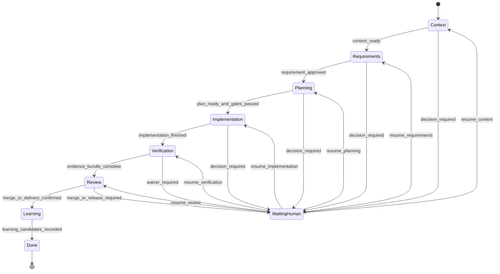

# 03 任务状态机

## 1. 设计目标

任务状态不能依赖某次聊天是否仍在上下文中。状态机必须：

- 支持执行器退出、上下文压缩、机器重启和 CLI 崩溃后的恢复。
- 将业务阶段与运行状态分开，避免大量重复的 `WAITING_*` 状态。
- 在任何阶段插入 Human DecisionRequest。
- 阻止 Agent 跳过 Requirement、风险、验证和最终 Review。
- 让每次状态迁移都由事件和 Artifact Digest 解释。

状态机语义计划使用 XState 表达，但持久化格式是 Harness 自有 Schema，避免运行时库版本成为存储协议。

### 1.1 当前实现切片

当前 `0.0.x` 运行时已经实现 `TaskCreated -> RequirementProposed -> RequirementApproved -> PlanProposed -> ImplementationReady`，并支持可选的 `BusinessLogicProposed -> BusinessLogicApproved`。当前代码使用 `TaskRunState.Running` 表示可继续执行，Checkpoint、Artifact、Approval 和 `pendingDecision` 保存在可由事件完整重建的 `TaskAggregate` 中。

当前持久化事件仅包含 `TaskCreated`、`ArtifactCommitted` 和 `ApprovalRecorded`。后文 Context、Implementation、Verification、Review、Learning 的完整事件与状态仍是目标架构，不应理解为当前 CLI 已经实现。

后续对齐已经将完整需求生命周期的所有权调整为 `RequirementWorkflowAggregate`，现有 `TaskAggregate` 将通过版本化迁移收缩为编码实现 Cell 内的 `CodingTaskAggregate`。在迁移完成前，本章记录的是当前兼容状态机，不再作为 Workflow 终态设计。新边界见 [21 需求生命周期 Workflow Runtime](./21-requirement-workflow-runtime.md)。

## 2. 正交状态模型

Task 状态由两个正交维度组成：

```ts
/** Task 当前所在的业务阶段。 */
export enum TaskPhase {
  /** 正在发现并校验项目上下文。 */
  Context = "context",
  /** 正在澄清需求并形成 Requirement Contract。 */
  Requirements = "requirements",
  /** 正在生成技术方案、风险和所需 Gate。 */
  Planning = "planning",
  /** 正在批准的 Write Set 内修改代码。 */
  Implementation = "implementation",
  /** 正在执行验证并构建 Evidence Bundle。 */
  Verification = "verification",
  /** 已准备好由 Human Review、Merge 或 Delivery。 */
  Review = "review",
  /** 正在生成知识和 Skill 候选。 */
  Learning = "learning",
  /** Task 已满足最终完成条件。 */
  Done = "done",
}

/** Task 当前是否允许继续自动执行。 */
export enum TaskRunState {
  /** Harness 可以执行当前 Phase 的下一个确定性步骤。 */
  Active = "active",
  /** Task 正在等待一个阻断性 Human DecisionRequest。 */
  WaitingHuman = "waiting_human",
  /** Human 或系统已安全暂停 Task。 */
  Paused = "paused",
  /** Task 因不可自动恢复的错误而停止。 */
  Failed = "failed",
  /** Human 或上游任务系统已取消 Task。 */
  Cancelled = "cancelled",
  /** Task 已完成并禁止继续执行业务动作。 */
  Done = "done",
}

/** Task 可持久化并由事件重建的正交状态。 */
export interface TaskState {
  /** Task 当前业务阶段。 */
  phase: TaskPhase;
  /** Task 当前运行状态。 */
  runState: TaskRunState;
  /** 当前 Phase 内最后完成的确定性检查点。 */
  checkpoint: string;
  /** 当前唯一阻断性 DecisionRequest；非等待状态不存在。 */
  pendingDecisionId?: string;
}
```

- `phase` 表示任务处于哪个业务阶段。
- `runState` 表示当前是否可以继续执行。
- `checkpoint` 表示阶段内部已完成的确定性步骤。
- `pendingDecisionId` 只能引用一个阻断性 DecisionRequest。

同一 Task 同时最多存在一个阻断性 Human 决策，其他问题必须合并为证据或非阻断风险，减少审批疲劳。

## 3. 主流程



图中的 `WaitingHuman` 是 `runState=waiting_human` 的可视化，实际 `phase` 不改变。审批后根据 DecisionRequest 中记录的 `resumeCheckpoint` 继续。

## 4. 阶段定义

### 4.1 Context

入口：Task 已创建并绑定 Workspace。

必须完成：

- 锁定基础 Revision。
- 解析 WorkspaceGraph 和 ProjectProfile。
- 确认 Read Set、初始 Write Set 和执行器能力。
- 收集 Ticket、代码、Git、Wiki、Instruction、Agent Registry、Memory Index 和测试入口。
- 对来源进行信任标记。

出口产物：由 WorkspaceGraph、ProjectProfile、Task、InstructionBundle、AgentInstance、MemorySelection 和 EvidenceRef 派生的 `ContextBundle`。ContextBundle 是运行时视图，不是独立规范 Artifact。

失败条件：仓库不存在、Revision 不可解析、Profile 严重过期、必需 Connector 不可用且无 Human 降级决策。

### 4.2 Requirements

入口：上下文达到最低完整度。

执行：

- Evidence-first Requirement Battle。
- 默认最多连续询问五个会改变实现的问题。
- 一次只请求一个 Human 决策。
- 生成 RequirementContract Proposal。

出口条件：RequirementContract 对应 Digest 已获 Human Approval。

未批准、被拒绝或 Artifact 变化时不得进入 Planning 的可执行部分。

### 4.3 Planning

执行：

- 生成 PlanRisk、测试计划、回滚计划和精确 Write Set。
- 根据 Scope、目标路径和任务类型解析 ApplicableRuleBundle，并固化 RuleBundle Digest。
- 识别目标模块必须沿用的架构机制、业务不变量和对应 Validator。
- 判断是否触发历史业务逻辑、公共层、跨仓或其他高风险 Gate。
- 必要时生成 BusinessLogicChangeContract。
- 调用 Solution & Risk Reviewer 独立检查。

出口条件：

- Requirement Approval 仍然有效。
- 所有触发的 Gate 均有匹配当前 Digest 的 ApprovalRecord。
- Executor、Model 和 Validator 能力满足计划。
- 每条 Blocking Rule 都有可执行 Validator，语义不确定项已转为 DecisionRequest。

低风险单仓任务不增加额外方案审批；历史逻辑或其他高风险变化必须等待 Human 确认。

### 4.4 Implementation

入口：Write Set 已冻结并通过 Gate。

执行：

- 创建或复用隔离 Worktree。
- 在批准仓库和路径内写入。
- 按 Action Journal 执行命令和变更。
- 记录变更、失败、重试和范围漂移。

发现以下情况立即停止并请求 Human：

- 需要扩大 Write Set。
- 实际行为与 BusinessLogicChangeContract 冲突。
- 需要跨仓写入。
- 需要破坏性、外部或不可逆操作。
- Human 确认 Requirement 需要更新，或基础 Revision 发生漂移。
- 实现需要偏离 ApplicableRuleBundle、既有架构机制或扩大已批准 Rule Exception。

### 4.5 Verification

执行：

- 运行 ProjectProfile 中的必需验证。
- 执行 ApplicableRuleBundle 中的确定性 Validator 和架构机制检查。
- 使用 Independent Verifier 在新鲜只读上下文中检查。
- 校验 Requirement、风险覆盖、Diff 和历史逻辑不变量。
- 生成 RuleComplianceReport 和 EvidenceBundle。

任何必需检查失败都不能进入 Review。无法执行的检查必须产生 DecisionRequest，并由 Human 明确 `waived`；Waiver 不等于检查通过。

### 4.6 Review

系统只准备 Review-ready 产物：

- Diff、Artifact、EvidenceBundle 和剩余风险。
- Human Approval 与 Waiver 列表。
- RuleComplianceReport、Rule Exception 和架构机制变化摘要。
- 建议合并和发布步骤。

首月 Harness 不执行自动 Merge 或 Release。Human 确认交付结果后才能进入 Learning。

### 4.7 Learning

- 汇总明确 Human 修正和重复失败。
- 运行 `memory-curator`，生成零到多个 Learning/MemoryCandidate。
- 更新任务指标。
- 生成 Knowledge、Rule、Instruction、Agent、Wiki 或 Skill Patch Proposal。

候选生成完成即可结束任务，不要求 Human 当场晋升候选，避免把知识治理阻塞在交付主路径上。

## 5. WAITING_HUMAN 语义

进入 `waiting_human` 时必须：

1. 持久化当前 Snapshot。
2. 创建唯一 DecisionRequest。
3. 释放不需要长期持有的进程锁。
4. 保留 Worktree，不继续修改代码。
5. 记录恢复 Phase、Checkpoint 和 Artifact Digest。

恢复时必须重新检查：

- Human 决策是否绑定当前 Digest。
- Base Revision、Write Set 和外部事实是否漂移。
- Approval 是否过期或被撤销。
- Worktree 是否出现 Harness 外变更。

任一条件变化时，旧 Approval 保留审计记录但不再授权执行。

## 6. Pause、Fail、Cancel

### Pause

Human 或系统可以安全暂停。Pause 不代表失败，恢复时执行与 `waiting_human` 相同的漂移检查。

### Fail

用于无法自动恢复的技术失败，例如 Store 损坏、Schema 不兼容、锁状态不可信。Fail 必须包含 FailureRecord 和建议的 Recovery Action。

### Cancel

只能由 Human 或上游任务系统发起。取消后：

- 不删除 Evidence 和事件。
- 默认保留 Worktree，等待显式清理。
- 不生成可晋升 LearningCandidate，除非取消原因本身包含明确 Human 修正。

## 7. 迁移守卫

每个迁移由 Core 同时检查：

- 当前 Phase、RunState 和 Checkpoint。
- 所需 Artifact 的状态和 Digest。
- 所需 ApprovalRecord。
- Policy、Risk 和 Executor Capability。
- Lock、Base Revision 和 Write Set。

Agent 的自然语言声明不是迁移条件。只有 CLI 成功写入的事件可以改变状态。

## 8. 完成定义

Task 只有在以下条件全部满足时进入 `done/done`：

- Human 已确认 Merge、Delivery 或明确的“不合并结束”。
- EvidenceBundle 完整且可读取。
- 所有 Waiver 可追踪。
- Worktree 处置状态已记录。
- 指标已结算。
- LearningCandidate 生成步骤已执行，结果可以为空。
- Instruction、Agent、Rule 和 Memory Selection Digest 已保存，可从新 Session 重建。

“代码已写完”不是完成状态。

## 9. 并发策略

- 首月初始每个 Workspace 同时只有 1 个 Active Task。
- 完成锁、恢复和冲突测试后，默认上限提升到 2。
- 同一仓库同一时刻最多 1 个写任务。
- 只读 Context Scout 和 Validator 可以并行，但不得读取未完成的部分写状态作为正式 Evidence。
- Background Agent 无法获得 Human 权限时必须失败返回，不能自动提升权限。
