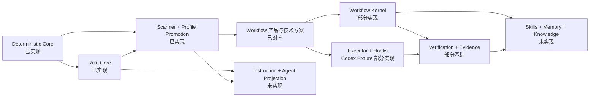

# 20 文档与实现状态矩阵

## 1. 目的

本矩阵分别回答技术方案是否写出、边界是否完成评审、产品能力是否实现。三者不能互相替代。文档完整不等于代码完成；开发过程中使用外部 Coding Agent 或脚本，也不等于 `liushi-harness` 已提供对应运行时能力。

## 2. 状态口径

| 状态          | 判定标准                                         |
| ------------- | ------------------------------------------------ |
| `implemented` | 代码、测试、文档、Changeset 和发布物均提供该能力 |
| `partial`     | 已有可复用产品能力，但文档中的完整闭环尚未实现   |
| `designed`    | 方案主体已经写出，尚无对应产品实现               |
| `pending`     | 仍需 Human/Lead 对齐关键边界，不能直接开工       |

## 3. 06-19 审计结果

| 文档                        | 方案状态 | 实现状态      | 当前可验证能力                                                                                                                                                                                                                                                                                                                                                        | 尚未实现或待确认                                                                                                                |
| --------------------------- | -------- | ------------- | --------------------------------------------------------------------------------------------------------------------------------------------------------------------------------------------------------------------------------------------------------------------------------------------------------------------------------------------------------------------- | ------------------------------------------------------------------------------------------------------------------------------- |
| 06 代码库组织               | 已完成   | `implemented` | 分层、循环依赖、目录、命名、Barrel、行数、TSDoc、中文注释、ESLint、Prettier、TS7/TS6 和 Changesets 门禁                                                                                                                                                                                                                                                               | 目标目录中的未来模块不计为能力                                                                                                  |
| 07 Workspace 与多仓         | 已完成   | `partial`     | 多仓身份、只读扫描、依赖歧义、Profile Proposal、G8、Profile Bundle、Managed Worktree 创建/检查、未知 Provision Human 对账与下游 Guard、Workspace/Repository 排他 Lock、单仓受控文件变更、可信 Repository Root 与 Git Checkpoint                                                                                                                                       | WorkspaceGraph Registry、Worktree 清理/重建和跨仓 Saga                                                                          |
| 08 Executor Adapter         | 已完成   | `partial`     | Codex Probe、Hook Binding、Pre/Post Adapter、CLI Wrapper、`hooks.json` 投影和 Fixture 测试                                                                                                                                                                                                                                                                            | 真实项目 Smoke、安装协议、Claude/CatPaw Adapter、Role Invocation                                                                |
| 09 Hooks 与 Agent Runtime   | 已完成   | `partial`     | Canonical Pre/PostAction、Codex `apply_patch` Projection/Wrapper、PlanRisk/Human Gate 授权、Dispatcher、Action Journal、Worktree Journaled Runner 与 Trace                                                                                                                                                                                                            | Verification Runner 接入、其他平台 Projection、自动安装、其他生命周期、Role Runtime 和 Human Battle                             |
| 10 模型路由与 Eval          | 已完成   | `designed`    | 无产品运行时能力                                                                                                                                                                                                                                                                                                                                                      | Model Registry、Router、升级、Eval Dataset 和成本策略                                                                           |
| 11 Skills 与 Connectors     | 已完成   | `designed`    | Scanner、CLI 和 Digest 可供未来复用                                                                                                                                                                                                                                                                                                                                   | Skill Registry/Runner、MCP、Wiki、Issue、Obsidian、认证和写入 Gate                                                              |
| 12 Verification 与 Evidence | 已完成   | `partial`     | G8 Profile Check、单仓确定性影响面、VerificationPlan、Local Command Runner、版本化 Verification Command/Journal 恢复、Git Revision 绑定、环境/超时/输出限制、EvidenceBundle 强一致 Store、幂等/冲突/篡改检测                                                                                                                                                          | Import Graph、Flaky、G5、Independent Verifier 和多仓验证                                                                        |
| 13 Learning 与 Knowledge    | 已完成   | `designed`    | 无产品运行时能力                                                                                                                                                                                                                                                                                                                                                      | Candidate Store、Eval、Promotion、Retrieval、Curator 和 Skill 改进                                                              |
| 14 生产 SOP                 | 已完成   | `partial`     | npm、Doctor、Task、Artifact、Approval、Rule、Scanner、Profile Compile、Codex Probe                                                                                                                                                                                                                                                                                    | 自动 Task Delivery、Executor、Workflow、验证、Memory、Learning 和长期治理命令                                                   |
| 15 交付路线                 | 已完成   | `implemented` | 能力门、决策门、完成门和真实项目验证口径                                                                                                                                                                                                                                                                                                                              | Workflow 后的切片顺序等待对齐                                                                                                   |
| 16 Rules 与代码合规         | 已完成   | `partial`     | Rule Schema、Catalog、Resolver、Scanner Candidate、G8 Profile Promotion                                                                                                                                                                                                                                                                                               | Validator Execution、ComplianceReport、Rule Exception、Pattern/Mechanism Registry 和编码期执行                                  |
| 17 Instruction Projection   | 已完成   | `designed`    | Rule/Profile 前置基础已具备                                                                                                                                                                                                                                                                                                                                           | Canonical Instruction、Resolution、Managed Merge Proposal 和三平台 Projection                                                   |
| 18 Memory Runtime           | 已完成   | `partial`     | Task Event、Snapshot、Artifact、Approval 和 Replay                                                                                                                                                                                                                                                                                                                    | Working/Project/Organization Memory、Retrieval、Compaction、Curation 和 Obsidian/Wiki                                           |
| 19 Agent Registry           | 已完成   | `designed`    | 无产品运行时能力                                                                                                                                                                                                                                                                                                                                                      | Registry、Resolution、Permission、Skill/Memory 绑定、Eval、平台渲染和 Runtime                                                   |
| 21 Workflow 产品与技术方案  | 已完成   | `partial`     | Command Gateway、Revision/Context、Replay、Timeline、Action Journal、Trace、Canonical Hook Core、RequirementWorkflow/CodingTask Aggregate 与 File Store、权威授权、单一 CodingTask CLI Cell、Managed Worktree、未知 Provision Human 对账与下游 Guard、受控文件变更、Git Checkpoint、ImplementationSubmitted、版本化 Verification Command、单仓影响面、PRReadyArtifact | 其余 CLI 迁移、Child Workflow、完整 Workflow Cell Runtime、平台 Hook/Executor、实时 Trace/Exporter、Worktree 清理/重建与 Studio |

### 3.1 本轮 S3 修订

本轮代码已将 `CodingTask Domain Core` 扩展为可调用的编码 Cell 持久化切片：

- `FileCodingTaskRepository` 提供严格 Event Schema、append-only JSONL、Hash Chain、目录 Locator 身份校验、锁、Replay 和 `outcomeUnknown` 边界。
- `CodingTaskCommandService` 通过 Application Command Gateway 提供 Create、Attempt、Verification、Human Control 和 Human Resolution 命令。
- 默认 Composition Root 通过上游 Task Replay 重算 PlanRisk、Business Logic G2、Approval 和 Write Set；调用方提交的 `ExecutionAuthorization` 只作为引用，不能绕过 Human Gate。
- 候选事件的非法状态返回 `InvalidStateTransition`；已提交日志的非法状态仍按 `CorruptStore` 处理。
- `WorktreeInspectorPort` 通过 `shell=false` 的 Git Command Runner 只读读取真实 Worktree，检查 Root containment、分支、Base Revision、完整状态和 Write Set 越界；异常只返回稳定诊断码，不泄露本机路径或命令输出。
- `VerificationPlan`、`VerificationExecutorPort` 和 `RunVerificationUseCase` 已定义验证边界；EvidenceBundle 绑定 Plan/Revision/Digest。默认 Mock 不执行命令；显式 Local Command 模式验证 Git Revision 并限制工作目录、环境、超时和输出。
- `RepositoryLockPort`、`AcquireRepositoryLockUseCase` 和 `NodeRepositoryLockAdapter` 已提供 Workspace/Repository 互斥；锁竞争错误不返回本机路径，Lock 句柄释放不执行任何 Git 或文件业务写入。
- `JournaledActionRunner` 已提供 Action 级跨进程执行锁、Intent-first 执行、完成态复用、`intent_recorded` 禁止自动重放、`retry_permitted` 受控重试、已有 Observation 的 Resolution 恢复，以及执行后 Journal 闭合失败的 `action_journal_commit_outcome_unknown`。
- `WorktreeProvisionCommandService` 已将 Runtime Root 摘要、CodingTask 权威授权、Repository Lock、Action Journal、真实 Git 创建和 Inspector 后置条件串成版本化写链路；未知结果必须由 Human 恢复检查。
- `AssessWorktreeProvisionRecoveryUseCase` 与 `WorktreeProvisionRecoveryCommandService` 已从可信 Root 联合检查路径、Registry、分支和 Worktree 状态；Human Command 必须绑定锁内重算的 Assessment Digest，且恢复过程不执行 Git 写入。
- `ImplementationCommandService` 已在权威授权、Write Set、Repository Lock 和 Action Journal 边界内提供受控文件创建、替换与删除，并以摘要后置条件确认结果。
- `VerificationCommandService` 已把 Verification 执行、EvidenceBundle 持久化和 CodingTask 结果接纳串成版本化 Journaled Command；未知结果禁止自动猜测。
- `SelectVerificationPlanUseCase` 已从 G8 Profile、CodingTask 最新 ImplementationSubmitted 和 Ready Rule Bundle 生成单仓确定性 Plan；Rule Target 覆盖或 Blocking Validator 映射不完整时关闭式阻断。
- `ImplementationSubmissionService` 已通过启动期可信 Repository Root、Managed Worktree 与原生 Git 创建单一 Checkpoint，以 `ImplementationSubmitted` 收口 Attempt；Git/Event 非 ACID 中间态只能由 Human 检查和接纳。
- `FileEvidenceBundleStore` 已提供不可变 Bundle 持久化、跨实例读取、同 Run 幂等/冲突、Domain 重校验、Digest 重算和提交未知态。

因此，表格中 CodingTask Store/Command 的旧描述以本节为准；Worktree 清理/重建、Import Graph、重试/Flaky、Waiver、多仓影响传播、真实项目生产验证和 Studio 仍未实现。

## 4. 当前产品边界

当前 npm 包实际提供：

- Runtime Store 健康检查。
- Task 创建、查询、Event Replay 和 Snapshot 完整性校验。
- 严格 Artifact Proposal、DecisionRequest、Human Approval 和 Gate。
- Rule Catalog 解析与 ApplicableRuleBundle Resolution。
- 显式多仓只读 Project Discovery。
- Human-gated ProjectProfile Proposal、G8 和 Profile Bundle 编译。
- ESM/CJS Library、`liushi-harness` 与 `lh` CLI。
- 版本化 Command/Receipt 和 Workflow S0 值对象的纯确定性契约。
- V1 Task Event 到语义摘要的 Golden Replay Fixture。
- 从权威 Event 历史生成且可供 Tracker 消费的版本化 Task Timeline Projection。
- 具备独立锁、Hash Chain、幂等追加、跨实例重放和恢复查询的持久化 Action Journal。
- 带 Action 级跨进程执行锁的 Intent-first Journaled Action 内核：Executor 调用前落盘、只在明确重试许可下重放、确定性补写 Resolution，并在执行后 Journal 无法闭合时阻断自动重试。
- 可丢失、可过滤、不会反向修改语义状态的完成态 Trace Span Observation。
- 使用原子 Reservation、独立 Lock 和稳定 Receipt 的持久化 Application Command Gateway。
- 执行器无关的 Canonical Action Hook 契约与 Dispatcher，并通过 PlanRisk Write Set、风险等级和精确 Human Approval 授权文件动作。
- PreAction Intent、PostAction Observation/Resolution 与完成态 Trace 的统一因果链。
- Codex `apply_patch` 的 Hook Workspace Binding、PreToolUse/PostToolUse Adapter、原生 stdin/stdout Wrapper 和确定性 `hooks.json` 配置投影。
- Codex 静态 Capability Probe：版本、帮助输出、命令处理器和 Hook/Native stdin 声明的版本化报告；不可执行或未知版本时 fail closed。
- RequirementWorkflow Aggregate/Reducer、Event Replay、File Store、版本冲突、幂等 Command 和 Human Pause/Resume/Cancel Gateway API。
- CodingTask 单仓 Aggregate/Reducer、独立 Schema、PlanRisk/G2 ExecutionAuthorization、Attempt 串行约束、Verification 结果接纳和 Human Resolution Domain API。
- CodingTask Worktree Inspector：真实 Worktree Root containment、分支、HEAD/Base Revision、Git 状态、Rename/Copy 解析、Write Set 越界检查和不泄露本机路径的稳定报告。
- Worktree Provision 未知状态恢复：从可信 Root 生成脱敏 Assessment，Human 绑定精确 Digest 后在 Repository/Action 双锁内闭合为 Recovered、RetryPermitted 或继续 WaitingHuman。
- Repository Lock：Workspace/Repository 作用域的排他文件锁、稳定 Lock Handle、幂等释放和脱敏 LockUnavailable 错误；该能力不授予 Worktree 创建或代码写入权限。
- 受控实现写入：只在权威授权、Write Set、Repository Lock、Action Journal 和内容摘要后置条件内执行显式文件变更。
- 实现提交：从可信 Repository Root 校验 Managed Worktree，以单一 Git Checkpoint 和 `ImplementationSubmitted` 把 Attempt 收口到 Verification；未知中间态由 Human 恢复。
- VerificationPlan/Check 严格校验、Verification Executor/Runner Port、串行验证用例、Required/Conditional/Advisory 状态聚合、输出 Digest 和不携带原始输出的 EvidenceBundle 装配；默认 Mock 未配置结果时 fail-closed 为 `Blocked`。
- 版本化 Verification Command：在 Repository Lock 与 Action Journal 内运行验证、持久化 EvidenceBundle 并接纳 CodingTask Verification 结果。
- Profile-backed Verification 影响面：由 G8 Check、权威 Changed Paths、Rule Target 和 Validator 映射生成单仓 Plan 与完整 Selection Trace。
- PRReadyArtifact 权威装配：只接受 Evidence Locator，从强一致 Store 读取 Passed Evidence，重算 Task-backed Human Gate，并绑定 Base/Head、Diff Digest、InputBindingSet、Verification、剩余风险和回滚方案。

当前 npm 包不提供：

- 自动需求澄清、Plan、Implementation、完整 Verification 和 Learning Workflow。
- 现有 CLI 写命令向 Command Gateway 的完整迁移、Child Workflow、完整 RequirementWorkflow Cell Runtime、Worktree 清理/重建和多仓 Verification 影响传播。
- Codex 真实受信任项目的自动安装与平台 Smoke、Claude-compatible 或 CatPaw Adapter。
- Agent 自主代码生成、多仓写入 Saga、PR、推送、合并、发布或部署。
- Skill、Connector、Wiki、Obsidian、Memory、Knowledge 或 Agent Registry Runtime。
- 完整项目 Validator Execution、真实命令输出存储/截断、Flaky/Waiver、Independent Verifier 和 ComplianceReport。

## 5. 依赖关系

该图表达 Workflow 评审后冻结的主要依赖。前置契约、Context Trust 和恢复语义先于真实 Executor；Tracker 依赖可重建 Query Projection，但不成为状态真源。

## 6. 文档阶段完成门

- `06-19` 每篇都有明确当前实现状态。
- 不再存在按四周或按月承诺交付的过时路线。
- 当前产品能力与目标能力在 README、SOP、路线图和专题文档中一致。
- Workflow Aggregate/Runtime 保持前置 Kernel 已实现；单一 CodingTask 编码 Cell 已可运行，完整 RequirementWorkflow Cell Runtime 仍未开工。固定 Cell/Failure 路由 Domain Policy、Event Replay、File Store、版本冲突和 Human 控制 API 已完成，Human/Lead 边界对齐继续有效。
- 所有 Markdown、链接、Prettier、文档索引和 Changeset 检查通过。

## 7. 下一实现门

Workflow 产品与技术方案已经对齐，持久化 Command Gateway、Revision/Context、Golden Replay、Timeline、Action Journal、JournaledActionRunner、Trace、Canonical Hook Core、Workflow Kernel 和 CodingTask Domain Core 已通过测试。Codex `apply_patch` Adapter、Binding、配置投影、CLI Wrapper 和静态 Probe 已完成 Fixture 验证；CodingTask Store/Command、单一纵向 CodingTask CLI Cell、Managed Worktree Provision/Inspector、未知 Provision Human 对账与下游 Guard、Repository Lock、受控文件变更、可信 Repository Root、Git Checkpoint、ImplementationSubmitted、版本化 Verification Command/EvidenceBundle、G8 Profile-backed 单仓影响面、fail-closed Mock、显式 Local Command Runner 和单仓 PRReadyArtifact 已完成。真实 Git E2E 已通过默认 Human Gate 与 PR-ready 装配；下一步完成 Checkpoint 后自动绑定 Verification Target Revision，并在受信任或公开项目完成 tarball 安装 Smoke 与 Human Touch Time 采集。Human-gated Worktree 清理与显式重建保持后续运维能力。Claude-compatible/CatPaw、自动安装和 Role Invocation 仍未实现。
