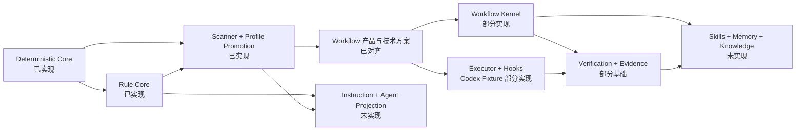

# 20 文档与实现状态矩阵

## 1. 目的

本矩阵分别回答技术方案是否写出、边界是否完成评审、产品能力是否实现。三者不能互相替代。文档完整不等于代码完成；开发过程中使用外部 Coding Agent 或脚本，也不等于 `liushi-harness` 已提供对应运行时能力。

## 2. 状态口径

| 状态          | 判定标准                                         |
| ------------- | ------------------------------------------------ |
| `implemented` | 代码、测试、文档、Changeset 和发布物均提供该能力 |
| `partial`     | 已有可复用产品能力，但文档中的完整闭环尚未实现   |
| `designed`    | 方案主体已经写出，尚无对应产品实现               |
| `pending`     | 仍需 Human/Lead 对齐关键边界，不能直接开工       |

## 3. 06-19 审计结果

| 文档                        | 方案状态 | 实现状态      | 当前可验证能力                                                                                                                                                                                                                                                                                                                  | 尚未实现或待确认                                                                                                             |
| --------------------------- | -------- | ------------- | ------------------------------------------------------------------------------------------------------------------------------------------------------------------------------------------------------------------------------------------------------------------------------------------------------------------------------- | ---------------------------------------------------------------------------------------------------------------------------- |
| 06 代码库组织               | 已完成   | `implemented` | 分层、循环依赖、目录、命名、Barrel、行数、TSDoc、中文注释、ESLint、Prettier、TS7/TS6 和 Changesets 门禁                                                                                                                                                                                                                         | 目标目录中的未来模块不计为能力                                                                                               |
| 07 Workspace 与多仓         | 已完成   | `partial`     | 多仓身份、只读扫描、依赖歧义、Profile Proposal、G8、Profile Bundle、Worktree/Write Set 只读检查、Workspace/Repository 排他 Lock                                                                                                                                                                                                 | WorkspaceGraph Registry、Worktree 生命周期、受控写入和跨仓 Saga                                                              |
| 08 Executor Adapter         | 已完成   | `partial`     | Codex Probe、Hook Binding、Pre/Post Adapter、CLI Wrapper、`hooks.json` 投影和 Fixture 测试                                                                                                                                                                                                                                      | 真实项目 Smoke、安装协议、Claude/CatPaw Adapter、Role Invocation                                                             |
| 09 Hooks 与 Agent Runtime   | 已完成   | `partial`     | Canonical Pre/PostAction、Codex `apply_patch` Projection/Wrapper、PlanRisk/Human Gate 授权、Dispatcher、Action Journal 与 Trace                                                                                                                                                                                                 | 其他平台 Projection、自动安装、其他生命周期、Role Runtime 和 Human Battle                                                    |
| 10 模型路由与 Eval          | 已完成   | `designed`    | 无产品运行时能力                                                                                                                                                                                                                                                                                                                | Model Registry、Router、升级、Eval Dataset 和成本策略                                                                        |
| 11 Skills 与 Connectors     | 已完成   | `designed`    | Scanner、CLI 和 Digest 可供未来复用                                                                                                                                                                                                                                                                                             | Skill Registry/Runner、MCP、Wiki、Issue、Obsidian、认证和写入 Gate                                                           |
| 12 Verification 与 Evidence | 已完成   | `partial`     | Evidence 基础类型、项目自身测试门禁、Artifact/Gate/Profile 来源摘要、VerificationPlan 校验、Verification Port、EvidenceBundle 装配和 fail-closed Mock Executor                                                                                                                                                                  | 真实 Command Runner、影响面、Flaky、G5、Independent Verifier 和多仓验证                                                      |
| 13 Learning 与 Knowledge    | 已完成   | `designed`    | 无产品运行时能力                                                                                                                                                                                                                                                                                                                | Candidate Store、Eval、Promotion、Retrieval、Curator 和 Skill 改进                                                           |
| 14 生产 SOP                 | 已完成   | `partial`     | npm、Doctor、Task、Artifact、Approval、Rule、Scanner、Profile Compile、Codex Probe                                                                                                                                                                                                                                              | 自动 Task Delivery、Executor、Workflow、验证、Memory、Learning 和长期治理命令                                                |
| 15 交付路线                 | 已完成   | `implemented` | 能力门、决策门、完成门和真实项目验证口径                                                                                                                                                                                                                                                                                        | Workflow 后的切片顺序等待对齐                                                                                                |
| 16 Rules 与代码合规         | 已完成   | `partial`     | Rule Schema、Catalog、Resolver、Scanner Candidate、G8 Profile Promotion                                                                                                                                                                                                                                                         | Validator Execution、ComplianceReport、Rule Exception、Pattern/Mechanism Registry 和编码期执行                               |
| 17 Instruction Projection   | 已完成   | `designed`    | Rule/Profile 前置基础已具备                                                                                                                                                                                                                                                                                                     | Canonical Instruction、Resolution、Managed Merge Proposal 和三平台 Projection                                                |
| 18 Memory Runtime           | 已完成   | `partial`     | Task Event、Snapshot、Artifact、Approval 和 Replay                                                                                                                                                                                                                                                                              | Working/Project/Organization Memory、Retrieval、Compaction、Curation 和 Obsidian/Wiki                                        |
| 19 Agent Registry           | 已完成   | `designed`    | 无产品运行时能力                                                                                                                                                                                                                                                                                                                | Registry、Resolution、Permission、Skill/Memory 绑定、Eval、平台渲染和 Runtime                                                |
| 21 Workflow 产品与技术方案  | 已完成   | `partial`     | Command Gateway、Revision/Context、Replay、Timeline、Action Journal、Trace、Canonical Hook Core、固定 Cell/Failure 路由 Domain Policy、RequirementWorkflow Aggregate/Reducer、File Store、Gateway Command API、CodingTask Domain Core、CodingTask File Store/Replay、Command Service、权威授权解析、Worktree/Write Set 只读检查 | CLI 迁移、Child Workflow、平台 Hook/Executor、实时 Trace/Exporter、Worktree 生命周期、Verification Runner/Evidence 与 Studio |

### 3.1 本轮 S3 修订

本轮代码已将 `CodingTask Domain Core` 扩展为可调用的编码 Cell 持久化切片：

- `FileCodingTaskRepository` 提供严格 Event Schema、append-only JSONL、Hash Chain、目录 Locator 身份校验、锁、Replay 和 `outcomeUnknown` 边界。
- `CodingTaskCommandService` 通过 Application Command Gateway 提供 Create、Attempt、Verification、Human Control 和 Human Resolution 命令。
- 默认 Composition Root 通过上游 Task Replay 重算 PlanRisk、Business Logic G2、Approval 和 Write Set；调用方提交的 `ExecutionAuthorization` 只作为引用，不能绕过 Human Gate。
- 候选事件的非法状态返回 `InvalidStateTransition`；已提交日志的非法状态仍按 `CorruptStore` 处理。
- `WorktreeInspectorPort` 通过 `shell=false` 的 Git Command Runner 只读读取真实 Worktree，检查 Root containment、分支、Base Revision、完整状态和 Write Set 越界；异常只返回稳定诊断码，不泄露本机路径或命令输出。
- `VerificationPlan`、`VerificationExecutorPort` 和 `RunVerificationUseCase` 已定义验证边界；EvidenceBundle 绑定 Plan/Revision/Digest，默认 Mock Executor 对未配置 Check 返回 `Blocked`，不执行任何命令。
- `RepositoryLockPort`、`AcquireRepositoryLockUseCase` 和 `NodeRepositoryLockAdapter` 已提供 Workspace/Repository 互斥；锁竞争错误不返回本机路径，Lock 句柄释放不执行任何 Git 或文件业务写入。

因此，表格中 CodingTask Store/Command 的旧描述以本节为准；Worktree 创建/管理、受控写入、Action Journal 接入、真实 Verification Command Runner、影响面选择、重试/Flaky、Waiver、多仓编排和 Studio 仍未实现。

## 4. 当前产品边界

当前 npm 包实际提供：

- Runtime Store 健康检查。
- Task 创建、查询、Event Replay 和 Snapshot 完整性校验。
- 严格 Artifact Proposal、DecisionRequest、Human Approval 和 Gate。
- Rule Catalog 解析与 ApplicableRuleBundle Resolution。
- 显式多仓只读 Project Discovery。
- Human-gated ProjectProfile Proposal、G8 和 Profile Bundle 编译。
- ESM/CJS Library、`liushi-harness` 与 `lh` CLI。
- 版本化 Command/Receipt 和 Workflow S0 值对象的纯确定性契约。
- V1 Task Event 到语义摘要的 Golden Replay Fixture。
- 从权威 Event 历史生成且可供 Tracker 消费的版本化 Task Timeline Projection。
- 具备独立锁、Hash Chain、幂等追加、跨实例重放和恢复查询的持久化 Action Journal。
- 可丢失、可过滤、不会反向修改语义状态的完成态 Trace Span Observation。
- 使用原子 Reservation、独立 Lock 和稳定 Receipt 的持久化 Application Command Gateway。
- 执行器无关的 Canonical Action Hook 契约与 Dispatcher，并通过 PlanRisk Write Set、风险等级和精确 Human Approval 授权文件动作。
- PreAction Intent、PostAction Observation/Resolution 与完成态 Trace 的统一因果链。
- Codex `apply_patch` 的 Hook Workspace Binding、PreToolUse/PostToolUse Adapter、原生 stdin/stdout Wrapper 和确定性 `hooks.json` 配置投影。
- Codex 静态 Capability Probe：版本、帮助输出、命令处理器和 Hook/Native stdin 声明的版本化报告；不可执行或未知版本时 fail closed。
- RequirementWorkflow Aggregate/Reducer、Event Replay、File Store、版本冲突、幂等 Command 和 Human Pause/Resume/Cancel Gateway API。
- CodingTask 单仓 Aggregate/Reducer、独立 Schema、PlanRisk/G2 ExecutionAuthorization、Attempt 串行约束、Verification 结果接纳和 Human Resolution Domain API。
- CodingTask Worktree Inspector：真实 Worktree Root containment、分支、HEAD/Base Revision、Git 状态、Rename/Copy 解析、Write Set 越界检查和不泄露本机路径的稳定报告。
- Repository Lock：Workspace/Repository 作用域的排他文件锁、稳定 Lock Handle、幂等释放和脱敏 LockUnavailable 错误；该能力不授予 Worktree 创建或代码写入权限。
- VerificationPlan/Check 严格校验、Verification Executor/Runner Port、串行验证用例、Required/Conditional/Advisory 状态聚合、输出 Digest 和不携带原始输出的 EvidenceBundle 装配；默认 Mock 未配置结果时 fail-closed 为 `Blocked`。

当前 npm 包不提供：

- 自动需求澄清、Plan、Implementation、完整 Verification 和 Learning Workflow。
- 现有 CLI 写命令向 Command Gateway 的完整迁移、Child Workflow、Cell Runtime、Worktree 创建/管理/写入、真实 Verification Command Runner 和影响面编排。
- Codex 真实受信任项目的自动安装与平台 Smoke、Claude-compatible 或 CatPaw Adapter。
- 自动代码写入、Worktree、多仓写入 Saga、合并、发布或部署。
- Skill、Connector、Wiki、Obsidian、Memory、Knowledge 或 Agent Registry Runtime。
- 完整项目 Validator Execution、真实命令输出存储/截断、Flaky/Waiver、Independent Verifier 和 ComplianceReport。

## 5. 依赖关系

该图表达 Workflow 评审后冻结的主要依赖。前置契约、Context Trust 和恢复语义先于真实 Executor；Tracker 依赖可重建 Query Projection，但不成为状态真源。

## 6. 文档阶段完成门

- `06-19` 每篇都有明确当前实现状态。
- 不再存在按四周或按月承诺交付的过时路线。
- 当前产品能力与目标能力在 README、SOP、路线图和专题文档中一致。
- Workflow Aggregate/Runtime 保持前置 Kernel 已实现、Cell Runtime 未开工；固定 Cell/Failure 路由 Domain Policy、Event Replay、File Store、版本冲突和 Human 控制 API 已完成，Human/Lead 边界对齐继续有效。
- 所有 Markdown、链接、Prettier、文档索引和 Changeset 检查通过。

## 7. 下一实现门

Workflow 产品与技术方案已经对齐，S0 的持久化 Command Gateway、因果标识、Revision/Context、Failure Taxonomy、Golden Replay、`outcomeUnknown`、Timeline、Action Journal、完成态 Trace、Canonical Action Hook Core、固定 Cell/Failure 路由 Domain Policy、S2 Workflow Kernel 和 CodingTask Domain Core 已通过测试。Codex `apply_patch` 的输入 Adapter、Binding、配置投影、CLI Wrapper 和静态 Capability Probe 已完成 Fixture 验证；CodingTask Store/Command、Worktree/Write Set 只读检查、Repository Lock、VerificationPlan/Port、EvidenceBundle 和 fail-closed Mock Executor 已完成，下一步是 Worktree 生命周期、真实 Verification Command Runner、影响面/重试策略、Action Journal 接入，以及继续等待 Human 在受信任真实项目中执行 Hook Smoke/Negative Test。Claude-compatible/CatPaw、自动安装和 Role Invocation 仍未实现。
