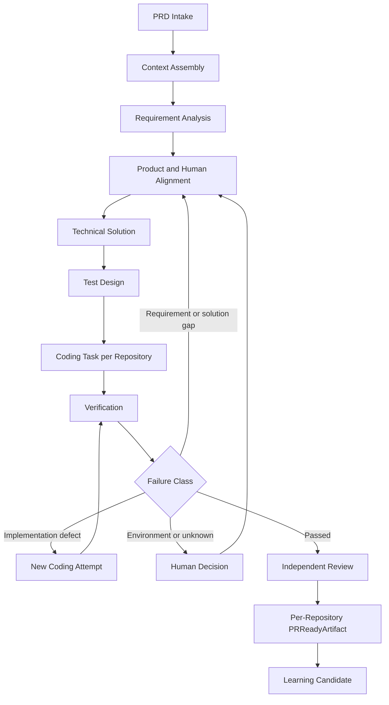
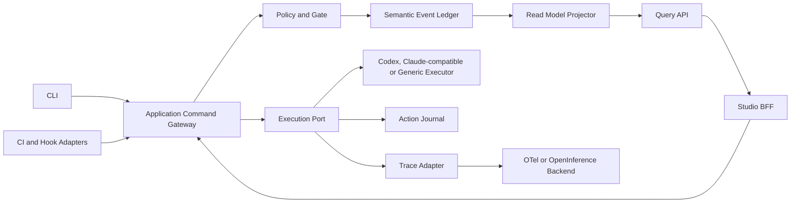

# 21 需求生命周期 Workflow 产品与技术方案

## 1. 状态与结论

状态：**`aligned`，允许进入前置契约实现，不允许跳过门禁直接接入真实 Executor。**

`liushi-harness` 的 Workflow 是本地优先、Human-gated、可审计、可恢复的需求交付语义内核。它编排从 PRD 输入到每个 Repository 达到 PR-ready 的完整生命周期，但不是通用 DAG、低代码平台或模型聊天外壳。

当前实现仍属于 Harness 前置机制：持久化 Command Gateway/Receipt、Revision/Context、Golden Replay、Event Unknown、只读 Task Timeline Query、持久化 Action Journal、Action 级执行锁、Intent-first JournaledActionRunner、可丢失的完成态 Trace Span Observation、执行器无关的 Canonical Action Hook Core、RequirementWorkflow 的固定 Cell/Failure 路由与 Human 控制 Domain Policy、RequirementWorkflow Aggregate/Reducer、File Store、Gateway Command API，以及 CodingTask 的单仓 Domain Core、File Store/Replay、Command Service、权威授权解析、Worktree/Write Set 只读检查、Repository Lock、VerificationPlan/Port、EvidenceBundle 装配和 fail-closed Mock Executor 已落地。现有 CLI 写命令尚未全部迁移到 Gateway，Codex/Claude-compatible 平台 Hook Projection 与安装、实时 Span 生命周期、OTel Exporter、Cell Runtime、Worktree 生命周期及其 Journaled Runner 接入、真实 Verification Runner、失败重试和 Studio 均未实现。

六角色评审后的核心结论：

- Harness 保存工程决定、有效 Revision、Gate、Attempt 和交付资格，是语义真源。
- CLI、未来 Studio BFF 与 CI Adapter 统一通过版本化 Application Command Gateway 写入。
- 首版只落地 `RequirementWorkflowAggregate` 与 `CodingTaskAggregate` 两个强一致性边界。
- `PRReadyArtifact` 是按仓库装配的确定性产物，不是 Agent Cell，也不是新的强聚合。
- Runtime 调度记录、Trace 与 Read Model 都不能反向修改语义状态。
- Studio 是与 Harness 同级的独立应用，消费稳定 Command、Query、Trace 和 Artifact 契约。
- 先完成 Command、Replay、Revision Binding、Context Trust 和副作用未知态，再实现 Agentic Workflow。

## 2. 产品闭环

首个完整闭环覆盖：

1. 导入 PRD 和 Workspace 当前 Revision。
2. 生成可复现的 `ContextManifest`。
3. 完成需求分析、业务历史确认和产品对齐。
4. 形成技术方案、风险、依赖和测试 Oracle。
5. Human 对历史逻辑改动、技术方案和风险操作作出明确决定。
6. 为受影响的每个 Repository 创建独立 `CodingTask` 和 Worktree。
7. Agent 在受控权限内编码，Harness 记录 Attempt、Action 与累计 Diff。
8. Verification 使用当前测试用例和完整累计 Diff 生成 Evidence。
9. 失败分类后进入 Bug Fix、上游澄清、环境处置或 Human Decision。
10. 每仓独立生成并审批 `PRReadyArtifact`，父 Workflow 维护跨仓交付顺序。
11. 产生 Learning Candidate，经后续治理决定是否晋升为 Project Memory、Rule 或 Skill。

自动化目标不是固定为 25%。25% 是首个生产安全基线；Workflow 的长期目标是提高可可靠闭合 Cell 的占比，同时持续降低 Human Touch Time、等待定位时间和返工率。

## 3. 产品边界

### 3.1 Harness 负责

- 版本化工程状态机、合法路由和 Human Gate。
- Artifact Revision、有效 Revision 选择与输入绑定。
- Command 幂等、并发冲突、Replay 和恢复语义。
- CodingTask、Worktree、Attempt、Write Set 和 Action Journal。
- Verification Evidence 与 PR-ready 资格装配。
- Agent、Skill、Rule、Context、Memory 和 Executor 的受控调用边界。
- 可重建 Query Projection、Trace 关联标识和 Studio SDK。

### 3.2 Harness 不负责

- 任意节点、表达式、脚本和补偿 DSL。
- 自动合并、发布、部署或无条件写入 Wiki。
- 用 Trace、模型自述或 Studio 数据库替代正式工程事实。
- 在没有测试或 Human 打断的情况下推断 Artifact 业务语义失效。
- 首版建设多租户 SaaS、OIDC、SCIM、RBAC、HA 和中央控制面。

企业能力通过版本化 Envelope、Store Port、Identity Port 和 Policy Context 预留，不抢占本地开源核心的实现顺序。

## 4. 领域所有权

### 4.1 RequirementWorkflowAggregate

拥有：

- Workflow 生命周期与合法 Cell 路由。
- 当前 Requirement、Business Logic、Solution 和 Test Revision 引用。
- Human Decision、Child Workflow 引用和 CodingTask 引用。
- 跨仓交付计划引用与整体等待原因。

不拥有 PRD 正文、完整 Evidence、模型 Trace、Executor Session、Worktree 文件或所有子流程内部状态。

### 4.2 CodingTaskAggregate

一个 CodingTask 只属于一个 Repository 和一个隔离 Write Set。它拥有：

- Repository、Base Revision、Worktree 与 Write Set 引用。
- 当前 `InputBindingSet`。
- Attempt、累计 Diff、Action 状态和实现阻塞项。
- 编码阶段局部验证结果引用。

它不拥有上游 Artifact 正文，也不能自行修改 Requirement、Solution 或 Test Revision。

### 4.3 Process 与产物

- `VerificationRun` 是可恢复执行记录，输出不可变 `EvidenceBundle`，结果必须经 Command 接纳。当前已实现 Plan/Port/Bundle 装配基础；默认 Mock 不执行命令，未配置 Check 固定为 `Blocked`。
- `PRReadyArtifact` 按 Repository 装配，绑定 Base/Head Revision、Write Set、Diff Digest、InputBindingSet、Evidence、依赖变更和剩余风险。
- `RepositoryDeliveryProcess` 协调每仓资格、审批与交付顺序，不提供伪原子跨仓事务。
- `WorkspaceGovernance` 继续由 ProjectProfile、Rule、Policy 和 Registry 边界负责；出现真实强一致性需求前不升级为聚合。

## 5. Cell 模型

Cell 是固定 Workflow Definition 中的闭合业务单元，不是通用插件基类。首批 Cell 类型为：

- PRD Intake
- Context Assembly
- Requirement Analysis
- Product Alignment
- Technical Solution
- Test Design
- Coding Task
- Verification
- Independent Review
- Learning Candidate

每个 Cell 必须定义输入 Schema、输出 Schema、Actor、允许的 Capability、前置条件、完成条件、Gate、Evidence、Checkpoint 和合法返回路由。跨平台 Hook、Agent 或 Skill 只是 Cell 的执行方式，不能拥有 Cell 状态。



Workflow 允许按预定义合法路由回退，不是只能向前执行的 DAG。

## 6. Human Decision

Human Command 支持 `answer`、`amend`、`approve`、`reject`、受 Policy 限制的 `waive`、`takeover`、`pause`、`resume` 和 `cancel`。

- 历史业务逻辑和其改动方案必须在编码前由 Human 确认。
- 风险操作必须由 Human 明确批准，不允许超时自动批准。
- Human 不直接修改 Store；CLI 和 Studio 操作都必须经过 Command、Policy、Gate 和 Event Commit。
- 一个 Workflow 可以同时存在多个互不依赖的 Decision Request；阻塞范围以 Cell 或目标聚合为边界，不把整个 Workspace 锁死。
- 修改上游 Artifact 时创建新 Revision，并显式选择返回 Cell 和新的 `EffectiveRevisionSet`。
- Harness 不做字段级业务失效推断。它只机械比较 `InputBindingSet` 是否仍引用当前有效 Revision；不一致时阻断交付，由测试或 Human 决定继续、回退或取消。

同一 CodingTask 默认保留 Worktree。新 Attempt 必须绑定 Human 当前确认的 Revision，并验证完整累计 Diff。安全隔离、Worktree 损坏、Base 无法恢复、Human 放弃方向或 CodingTask 取消时才创建新 Worktree。

## 7. 写入、执行与观测边界



### 7.1 Application Command Gateway

版本化的是 Command Envelope、Payload 和 Receipt，不是网络服务或 Use Case 类名。首版保持进程内 Facade：

```text
schemaVersion
commandId
commandType
aggregateType
aggregateId
expectedAggregateVersion
idempotencyKey
requestDigest
actorClaim
authorizationContext
correlationId
causationId
submittedAt
payload
```

`CommandReceipt` 结果为 `committed`、`rejected`、`conflict`、`duplicate` 或 `outcomeUnknown`。同一 Aggregate、Command Type 和 Idempotency Key：

- Request Digest 相同，返回原 Receipt。
- Request Digest 不同，返回稳定的幂等冲突。
- 无法判定 Event 或外部副作用是否完成时返回 `outcomeUnknown`，禁止盲目自动重试。

### 7.2 三类记录

- Semantic Event：过去式工程事实，是聚合 Replay 的唯一真源。
- Action Journal：副作用 Intent、Observed、Committed、Not Applied 与 Outcome Unknown。
- Trace Observation：Span、Tool Call、Token、成本、日志和延迟，可丢失，不参与 Replay。

三者共享 `commandId`、`correlationId`、`causationId` 和 `actionId`。Trace 丢失不影响恢复；Action Journal 无法确认时必须阻断副作用。

## 8. Context、Memory 与注入边界

Agentic Workflow 开工前必须具备最小 Context/Memory 基线：

- `ContextManifest` 记录 Source Locator、Revision、Digest、Scope、Trust Level、选择原因和截断原因。
- `ContextBundle` 是由 Manifest 渲染的运行时投影，不是新的事实源。
- Instruction、正式 Artifact、Evidence、Project Memory Recall 和外部 Untrusted Content 分通道。
- Wiki、Ticket、Repository、Tool Output 和 Memory 文本不能修改 Permission、Gate、Tool Allowlist 或输出 Schema。
- Tool 通过结构化 Tool ID 与参数调用，禁止从模型自然语言拼接 Shell。
- `ProposalEnvelope` 记录 Model、Agent、Prompt、Skill、Tool Schema、Context Manifest 和 Policy Digest 版本。
- Memory Provider Contract 和 `none` 实现前置；完整检索、压缩、Obsidian/Wiki 同步与自动晋升按后续切片实现。

## 9. 多仓与 Child Workflow

产品语义从一开始支持整个 Workspace：

- 每个 Repository 使用独立 CodingTask、Worktree、Verification 和 PRReadyArtifact。
- 父 Workflow 保存 `CrossRepositoryDeliveryPlan`，描述兼容窗口、Feature Flag、Schema/API 迁移顺序和拒绝后的处理。
- 每仓独立审批，但不能绕过跨仓依赖顺序。
- 子需求具备独立目标、验收和依赖时创建 Child Workflow；递归能力由版本化 `ChildWorkflowPolicy` 管理，不写死任意层数预算。
- 首个实现 Fixture 可先验证单仓竖切，但公共 Contract 不得把产品能力限制为单仓。

## 10. Studio 与生态

`workflow-studio` 是与 `liushi-harness` 同级的独立应用：

1. Tracker：Workflow、Cell、Revision、Attempt、Evidence、成本、等待原因和失败分类。
2. Decision Inbox：只提交已注册的 answer、amend、approve、reject、waive 等 Command。
3. Debug/Replay：读取可重建投影和 Trace 链，不直接读写聚合内部状态。
4. Experiment：比较 Model、Prompt、Skill、Context 和 Policy 版本的 Eval 数据。
5. Builder：只在至少两个稳定 Workflow Template 证明需要可视化变体后建设。

开源复用策略：

| 能力                                                                                                                                                                                    | 取舍                                                                |
| --------------------------------------------------------------------------------------------------------------------------------------------------------------------------------------- | ------------------------------------------------------------------- |
| [React Flow](https://reactflow.dev/)                                                                                                                                                    | 后续只做依赖和模板可视化，不采用其图模型作为 Harness 语义           |
| [TanStack Table](https://tanstack.com/table/v8)                                                                                                                                         | Tracker 列表与大数据量交互组件                                      |
| [OpenTelemetry](https://opentelemetry.io/docs/specs/semconv/) + [OpenInference](https://github.com/Arize-ai/openinference)                                                              | Trace 交换层，通过版本化 Adapter 隔离演进                           |
| [Jaeger](https://github.com/jaegertracing/jaeger)、[Langfuse](https://github.com/langfuse/langfuse/blob/main/LICENSE)                                                                   | 可选 Trace/Eval Backend，不成为 Workflow 真源                       |
| [Backstage](https://backstage.io/docs/overview/architecture-overview/)                                                                                                                  | 企业已有部署时作为可选宿主，不作为 Studio 默认基座                  |
| [Temporal](https://github.com/temporalio/temporal/blob/main/docs/architecture/README.md)                                                                                                | 保持 Durable Engine 候选 Adapter，先通过 conformance fixture 再选型 |
| [Phoenix](https://github.com/Arize-ai/phoenix/blob/main/LICENSE)                                                                                                                        | 当前许可证不适合默认开源基座，仅允许用户自行选择 Adapter            |
| [Dify](https://github.com/langgenius/dify/blob/main/LICENSE)、[LangGraph](https://github.com/langchain-ai/langgraph/blob/main/LICENSE)、[Temporal UI](https://github.com/temporalio/ui) | 不 fork，避免其领域模型反向定义 Harness                             |

## 11. Harness 调整与迁移

现有 `TaskAggregate` 是可工作的当前切片，不立即大规模重命名或双写两套状态机。迁移顺序：

1. 冻结 V1 Event Schema，建立 create、artifact、approval、reject-new-revision、并发和损坏 Replay 的 Golden Streams。
2. 在现有 Use Case 外增加 Versioned Application Command Gateway，不改变当前行为。
3. 增加 Command Receipt、统一幂等、因果标识和 `outcomeUnknown`。
4. 增加 `EffectiveRevisionSet`、`InputBindingSet`、`ContextManifest` 和 Failure Taxonomy。
5. 定义 Workflow V2 Event 和 engine-neutral conformance fixture。
6. 新 Workflow 只写 V2；V1 Store 保持可读，不在 Replay 时猜测旧事件语义。
7. 完成迁移 dry-run、语义摘要比较和回滚后，再收缩旧 Task 为 CodingTask。
8. 对外只稳定 `commands`、`queries`、`contracts` 和 `testing` 子路径；内部 Aggregate、Reducer、Infrastructure 不作为兼容承诺。

Snapshot 只是缓存；版本不兼容时从 Event 重建。Event 迁移写入新 Namespace，验证通过后切换 Store Pointer，不原地改写历史。

## 12. 实施切片与门禁

| 切片                          | 交付                                                                                                                                                                                                                                                                                            | 完成门                                                                                                                                                             |
| ----------------------------- | ----------------------------------------------------------------------------------------------------------------------------------------------------------------------------------------------------------------------------------------------------------------------------------------------- | ------------------------------------------------------------------------------------------------------------------------------------------------------------------ |
| S0 语义与迁移基线             | Golden Streams、Command/Receipt、因果标识、Failure、Revision Binding、Context Trust、conformance fixture                                                                                                                                                                                        | 同一 Event 序列确定性恢复相同状态；每个当前 Artifact 可解释其上游 Revision 与 Command                                                                              |
| S1 存储正确性                 | 通用幂等、`outcomeUnknown`、reconciliation、崩溃故障注入                                                                                                                                                                                                                                        | 每个副作用都能判定 Committed、Not Applied 或 Unknown；Unknown 不自动重试                                                                                           |
| S2 Workflow Kernel            | Human-driven 固定 Workflow、合法路由、Event Replay、版本化 Command、暂停/恢复/取消                                                                                                                                                                                                              | RequirementWorkflow Aggregate/Reducer、File Store、重复 Command、版本冲突和 Human 控制 API 已完成；Child 引用、上游 Revision 更新 Command 与 Cell Runtime 仍待实现 |
| S3 CodingTask 与 Verification | CodingTask Domain Core、独立 Schema、File Store/Replay、Command Service、权威 ExecutionAuthorization、Attempt/Verification 状态机、Human Resolution、Worktree/Write Set 只读检查、Repository Lock、JournaledActionRunner、VerificationPlan/Port、EvidenceBundle 装配、fail-closed Mock Executor | Worktree 生命周期、受控写入、Worktree/Verification Runner 接入、真实 Verification Runner、影响面/重试策略；崩溃可恢复、环境失败不进入 Bug Fix、需求歧义返回 Human  |
| S4 单一真实 Executor          | 一个主路径 Adapter、Tool Policy、结构化 Proposal、Trace                                                                                                                                                                                                                                         | 权限、注入、取消、超时、错误模型和 Schema 失败负向测试通过                                                                                                         |
| S5 PR-ready 与多仓            | 每仓 PRReadyArtifact、依赖顺序和部分失败恢复                                                                                                                                                                                                                                                    | 任一仓拒绝、Base 漂移或部分成功都有显式恢复路径                                                                                                                    |
| S6 Studio Tracker 与 Inbox    | Query Projection、Timeline、Decision Inbox、Trace 链接                                                                                                                                                                                                                                          | Projection 可重建；所有写操作只经 Gateway；无旁路状态                                                                                                              |
| S7 Knowledge Flywheel         | Learning Candidate、Memory/Rule/Skill Promotion                                                                                                                                                                                                                                                 | 无来源、Revision、Scope 或 Eval 的知识不得进入默认 Context                                                                                                         |
| S8 Durable 与企业 Adapter     | Engine Bake-off、Remote Store、Identity、RBAC、审计                                                                                                                                                                                                                                             | 候选不改变领域 Event；企业越权测试 fail closed                                                                                                                     |
| S9 Studio Builder             | 模板编辑、版本比较和实验编排                                                                                                                                                                                                                                                                    | 至少两个稳定 Workflow Template 证明通用变体价值                                                                                                                    |

切片不绑定日历期限。可以并行实现无冲突的基础能力，但不能绕过进入门和完成门。

## 12.1 S3 CodingTask 实现修订

当前 `CodingTask` 已具备可恢复的 File Store、严格 Schema/Hash Replay、Versioned Command Gateway/Service 和默认 Task-backed Authorization Policy。该 Policy 会回读上游 Task 的 PlanRisk、Business Logic Artifact、Approval 和 Write Set，未通过 Human Gate 或发生 Write Set 漂移时拒绝创建。

当前仍缺少 Worktree 创建/管理、受控写入、Worktree/Verification 对 Journaled Runner 的接入、真实 Verification Command Runner、影响面选择、重试/Flaky、Waiver、Child Workflow 和 Cell Runtime；Workflow Studio 仍是同级独立包，不在本轮 Harness 实现范围内。Worktree Inspector 只读检查真实 Root、分支、Base Revision、Git 状态和 Write Set 越界，不执行创建、删除、Reset、Checkout、Merge 或文件写入。Repository Lock 只提供协调互斥，不代表 Worktree 生命周期已经可用；Verification Mock 仅用于契约和测试，不代表生产执行能力。

## 13. 发布阻断条件

- Event Commit 或外部副作用无法区分失败与 `outcomeUnknown`。
- PRReadyArtifact 无法证明全部当前 Revision、完整累计 Diff 和 Verification Evidence。
- Event Replay 与 Query Projection 不一致。
- Studio 可以伪造 Human、绕过 Command 或直接修改状态。
- Context 或 Tool Output 能修改权限、Gate、Tool Allowlist 或输出 Schema。
- 测试失败未分类就自动重试，或把需求歧义当作实现缺陷。
- Memory 条目缺少来源、Revision、Scope 或可信等级却进入默认 Context。

## 14. 已冻结与延后决策

已冻结：

- 产品支持 Workspace 与多仓；每仓独立交付。
- 风险和历史逻辑改动必须 Human 确认。
- CodingTask 是 Workflow 的编码 Cell 边界。
- 测试或 Human 打断控制回退，不实现业务语义级通用失效算法。
- Studio 独立于 Harness，Harness 的 CLI 能独立完成流程。
- Workflow Definition、Command、Event、Query 和 Trace 契约必须版本化。

延后但已预留接口：

- 多人远程 Studio 的 Identity/RBAC 与中央控制面。
- Durable Engine 最终选型。
- Trace/Eval Backend 默认组合。
- 可视化 Builder 的具体技术栈与交互模型。
- 企业开源与商业能力的最终许可证边界。
