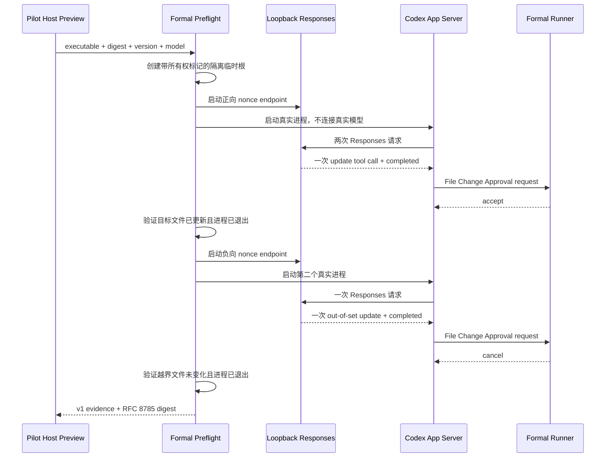

# Codex App Server 零模型 Preflight

## 1. 状态与目标

Codex App Server Preflight 已迁入正式
`src/infrastructure/executors/codex/agentHost/preflight/`。它在生成 Host Approval
Packet 之前，以两个隔离的真实 Codex 进程验证当前可执行文件是否仍满足 Harness
依赖的 File Change Approval 协议。

该检查只回答以下问题：

- 精确的 Codex 可执行文件、版本和摘要是否与本次证据绑定。
- App Server Runner 能否完成一个允许更新场景和一个明确拒绝场景。
- 本地 Responses 传输、审批状态机、文件结果和进程退出证据是否同时闭合。
- 全程是否保持真实模型请求数为零。

Preflight 不判断业务需求，不批准历史逻辑改动，也不替代真实任务的 Human Gate。

## 2. 分层

```text
src/infrastructure/executors/codex/agentHost/preflight/
  constants/    schema、固定计数、资源限制和环境白名单
  contracts/    输入、输出、证据、工作区与依赖契约
  enums/        场景、结果、执行模式和 SSE 事件闭集
  environment/  无凭据进程环境
  evidence/     RFC 8785 摘要、证据创建和严格校验
  loopback/     带随机 nonce 的本地 Responses SSE 服务
  platform/     Windows/POSIX 路径身份差异
  probe/        两场景编排、Runner 调用和结果收口
  workspace/    临时根所有权、场景目录和磁盘结果验证
```

Preflight 复用正式 App Server Runner 和 Session Flags，不复制协议状态机或参数编码。
OS 路径差异只存在于 `platform/`；旧 Pilot 的 `host/preflight/` 只保留一个构建产物桥。

## 3. 执行流程



负向场景使用语法和协议均有效的既有文件更新，由授权回调显式返回拒绝。它不是依赖
Codex 在解析补丁前报错，因此确实覆盖 Harness 的 Human 授权拒绝闭环。为让 Proposal
到达授权回调，负向路径会临时进入该合成 Runner 的技术 `allowedPaths`；这个场景不
冒充路径 Allowlist 测试，Runner 自身的路径拒绝由独立单元测试负责。

## 4. 固定证据契约

当前证据 schema 为
`liushi.codex-agent-host.app-server-preflight.v1`，只接受
`codex-cli 0.145.0`。证据固定包含：

| 字段                           | 固定值或约束                                    |
| ------------------------------ | ----------------------------------------------- |
| `processCount`                 | `2`                                             |
| `realModelRequests`            | `0`                                             |
| `authorizationOrigin`          | `synthetic_preflight`，不代表 Human Approval    |
| `transport.supportsWebsockets` | `false`                                         |
| `transport.websocketAttempts`  | `0`                                             |
| `transport.reconnectAttempts`  | `0`                                             |
| 正向 Responses 请求            | `2`，一次 tool call，两次 completed             |
| 负向 Responses 请求            | `1`，一次 tool call，一次 completed             |
| 正向 Runner outcome            | `succeeded`，目标文件发生预期更新               |
| 负向 Runner outcome            | `denied`，越界目标保持原始内容                  |
| 进程状态                       | 两个场景均确认退出，`processMayBeRunning=false` |

证据摘要使用仓库统一的 RFC 8785 Canonical JSON SHA-256 实现。读取方必须同时绑定
预期的 `codexExecutableDigest` 和 `codexVersion`；未知字段、字段缺失、计数漂移、
状态迁移漂移或摘要不一致全部 fail closed。

## 5. 安全边界

- 环境只从明确白名单复制宿主运行所需字段，不复制 API Key、证书或其他凭据。
- 所有代理变量被清空，`NO_PROXY` 只保留 loopback。
- Responses 服务只监听 `127.0.0.1`，路径包含 32 字节随机 nonce，并限制请求体大小。
- 请求必须匹配固定 Codex 版本的精确 JSON 字段集合、Content-Type、model、流模式、
  工具选择和唯一固定 Prompt；仅命中 URL 的任意 POST 不能形成证据。
- 每个场景使用独立 Codex Home、SQLite Home、Profile、Temp 和工作目录。
- 临时根通过 schema、随机 owner token、owner marker、可信父目录和节点集合复验。
- 场景验证拒绝符号链接、额外节点、路径漂移和非预期文件内容。
- Server 关闭和 Codex 进程树退出都必须得到确认；无法确认进程退出时保留恢复描述，
  不自动清理可能仍被占用的临时根。
- Preflight 不使用危险审批绕过参数，也不读取用户项目配置、Skill 或 MCP 配置。

## 6. Host 集成

Pilot 的 `preview-host` 调用正式 Preflight，并将完整 v1 Evidence 及其摘要写入 Host
Approval Packet v3。Packet 创建时会再次绑定当前 State 中的 Codex 摘要和版本。

旧 v2 Packet 不会被静默升级或重新签名。升级后必须重新执行 `preview-host`，再由
Human 审阅并批准新的精确 Packet Digest、State Digest 和 Actor。Preflight 中的
合成 accept/cancel 只验证协议，不构成真实任务审批；历史业务逻辑、方案、风险和
Write Set 仍必须在真实 Host Launch 前由 Human 确认。

Evidence Digest 只提供内容完整性，不提供独立签名或执行来源认证。当前受信边界是
生产 `preview-host` 在同一进程内直接运行正式 Probe，并将返回值写入受控状态和
Packet；CLI 不接受调用方提供的 Evidence，测试依赖替换也不进入生产 Composition
Root。未来 Application Host 如果需要跨进程接收 Evidence，必须先引入受信执行记录
或强一致 Store 绑定，不能直接信任调用方自报的结构化 Evidence。

## 7. 公开边界

Preflight 作为 Agent Host 内部基础设施生成独立构建入口：

```text
dist/infrastructure/executors/codex/agentHost/preflight/index.js
```

它未从 npm 根导出，也未并入 `agentHost/index.ts`。当前调用方只有受控 Pilot Host，
后续 Application Host 可以在形成稳定 `preview -> approve -> run -> status` 契约后
消费该入口。

## 8. 非目标

本切片不实现：

- 完整 Application Host 生命周期和公共 CLI。
- 真实模型质量、模型路由或需求理解验证。
- 企业项目生产声明、效率量化或多仓交付。
- Human 身份认证、自动审批或业务 Gate 替代。
- Claude-compatible、CatPaw、Skill、Memory、Wiki 或 Workflow Runtime。

## 9. 本机动态验收

2026-07-31 在 Windows x64 上以正式 `dist` 入口和真实 `codex-cli 0.145.0`
完成零模型验收：

- Preflight 模型标识：`gpt-5.6-sol`。
- Codex 可执行文件摘要：
  `sha256:83751f15cb6a0a7b97df67752c001e3fe1c20e18ffbfec3ff63567296205eb6c`
- Preflight Evidence 摘要：
  `sha256:1f5647d98c190df8b5aa222f5527af45f8e9bcde508ec6fc67ce1600e9c7b058`
- 授权来源固定为 `synthetic_preflight`，不构成 Human Approval。
- 正向：`succeeded`、2 次 Responses 请求、1 次本地 tool call、目标已更新。
- 负向：`denied`、1 次 Responses 请求、1 次本地 tool call、目标未变化。
- 两个进程均确认退出，真实模型请求数为 0。

该记录只证明上述精确版本、二进制和本机环境中的 Preflight 行为，不外推为完整
Application Host、其他 Codex 版本、其他 OS 或企业项目生产结论。
