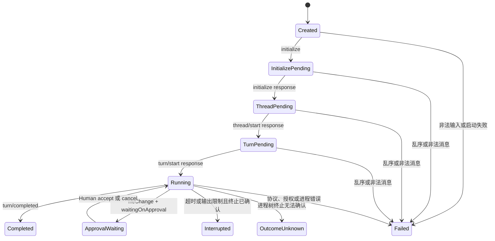

# Codex App Server Runner 技术方案

## 1. 目标与边界

本切片把固定公开项目 Pilot 已验证的 Codex App Server Runner 迁入正式
`Infrastructure`，形成 Runtime Isolation 之后第二个可复用的 Codex Agent Host
基础模块。迁移保持现有运行语义和旧 Pilot 导出兼容，不扩张为完整 Agent Host。

本切片包含：

- App Server 进程启动、标准流、JSONL 分帧、超时和进程树终止。
- `initialize -> thread/start -> turn/start` 请求序列。
- Turn、Item、Thread Status 和 File Change Approval 的受限协议状态机。
- Write Set 路径校验、Human Approval 回调和规范化审计摘要。
- 结果、协议证据、进程证据和失败不确定性分类。
- Windows 与 POSIX 进程终止策略的独立平台适配。

本切片不包含：

- Prompt 生成、模型路由、Session Flags 或零模型 Preflight。
- CodingTask、Workflow、Memory、Skill 或 Project Profile 编排。
- 固定项目、固定仓库、固定任务或固定模型配置。
- Hooks List 客户端、完整 App Server API 客户端或跨执行器 Port。
- Claude-compatible、CatPaw、Studio 或多仓写入编排。

## 2. 生产契约

正式 Runner 只接收上层已确定的运行输入：

- Codex 可执行文件、严格 App Server 参数和隔离环境。
- 当前工作目录、Runtime Workspace Roots 和允许写入的绝对路径。
- Prompt、模型与 Model Provider。
- 超时、标准输出和标准错误上限。
- `authorizeFileChange` Human Gate 回调。

`authorizeFileChange` 是唯一文件写入授权入口。回调必须显式返回
`approved: true | false`；批准时必须提供可规范化为 JSON 的证据。以下情况统一
fail closed：

- Proposal 超出允许路径、包含移动语义、重复路径或不支持的 Change Kind。
- 回调抛错、返回继承属性、缺失显式 Decision 或批准时缺失证据。
- Approval Request 重复、并发、乱序或与当前 Thread、Turn、Item 不一致。
- `thread/started`、`turn/started` 或 `serverRequest/resolved` 缺失、提前或重复。
- 历史逻辑的改动没有经过上层 Human Gate 确认。

Runner 不理解业务语义，也不自行降低风险等级。上层必须在调用 Human Gate 前展示
业务逻辑、改动方案、风险和 Write Set；Runner 只执行该确定性授权结果。

## 3. 分层

```text
src/infrastructure/executors/codex/agentHost/appServer/
  adapter/       组合正式 Runner，并保留旧入口别名
  audit/         Canonical JSON 与 SHA-256 审计摘要
  constants/     非闭集常量和固定默认值
  contracts/     输入、输出、协议、进程和可注入依赖契约
  enums/         协议方法、状态、Decision、Outcome 等闭集
  platform/      路径身份和 Windows/POSIX 进程树策略
  process/       子进程、标准流、限制、终止确认和结果收口
  protocol/      JSON-RPC 分发、状态、Approval、Notification 和证据
  validation/    Runner 输入与 File Change Proposal 校验
```

每个目录通过 `index.ts` 导出，文件和目录使用小驼峰命名。单文件不超过 300 行。
`protocol` 与 `process` 不依赖 Application 层；OS 分支只能进入 `platform`。

## 4. 协议状态机



成功路径继续要求固定 Pilot 已验证的四段 Thread Status 序列：

1. `active([])`
2. `active([waitingOnApproval])`
3. `active([])`
4. `idle`

该序列是当前受限 File Change Session Policy，不外推为 Codex App Server 的全部能力。
Phase 由三个客户端响应推进；`thread/started` 和 `turn/started` 另行作为后续
Item、Approval 和 Turn 终态的前置证据，通知不能替代对应响应建立身份。

## 5. 上游类型复用

上游基线来自
[Codex App Server 文档](https://learn.chatgpt.com/docs/app-server.md)、
[OpenAI Codex App Server 源码](https://github.com/openai/codex/tree/main/codex-rs/app-server)
和随当前 Codex 版本提供的 Schema Generator。

本项目需要持有 File Change Approval、流式生命周期和进程终止证据，因此复用 App
Server Host Surface；Codex SDK 更适合非交互任务，不替代本切片的 Host Gate。

Codex `app-server generate-ts` 是 Wire DTO 的权威来源。本次审计使用
`codex-cli 0.146.0-alpha.3.1` 和 `--experimental` 生成了 698 个文件；整体检入会
引入大量未使用 API 和版本漂移，因此本切片采用以下策略：

1. 只为实际消费的方法定义最小结构类型。
2. 类型字段与生成快照中的 V2 DTO 对齐。
3. 所有外部 JSON 继续通过运行时校验，生成类型不能替代安全边界。
4. 升级 Codex 版本时，在临时目录重新生成并比较本模块消费的字段。
5. 未经动态验证的新方法、字段或状态不得直接加入允许集合。

本切片不额外引入通用 JSON-RPC 编排库。现有 JSONL Transport 只负责顺序收发，
主要复杂度来自 File Change、Human Approval 和终止不确定性的受限状态机；通用库
不能替代这些业务安全约束，新增依赖也不会减少核心实现。

## 6. 兼容策略

旧 Pilot 的 `appServer` 目录最终只保留构建产物桥，指向：

```text
dist/infrastructure/executors/codex/agentHost/appServer/index.js
```

必须保持以下行为：

- `runCodexAgentAppServer`、`runCodexAppServer` 和
  `runCodexAgentAppServerRunner` 三个入口等价。
- 旧常量名称、值、默认限制和 Required Thread Status Transitions 不变。
- 进程层继续兼容直接注入协议实例和通过 IO 工厂创建协议两种调用方式。
- `status` 继续等于 `outcome`。
- 正常批准、明确拒绝、路径拒绝、协议失败、超时、输出限制和终止未知的分类不变。
- Preflight、Evidence、SessionFlags 和 Pilot Service 无需感知迁移。

Session Flags 已作为独立 Agent Host Infrastructure 模块完成正式化；Runner 仍只负责 App Server 协议、进程生命周期和 File Change Approval，不吸收 Session Flags、Preflight 或 Application Host 生命周期。

旧 `hooks/list` 客户端不是 File Change Runner 的职责，本切片不合并它。

## 7. 安全与验收门

完成条件：

- Spawn 固定使用 `shell: false` 和 `windowsHide: true`。
- Windows 与 POSIX 终止逻辑只存在于 `platform`。
- Prompt、Diff、Stdout、Stderr 和 Approval Evidence 不进入明文结果。
- 非法 JSONL、未知消息、乱序、重复和身份漂移全部 fail closed。
- 终止无法确认时返回 `outcome_unknown` 语义，不声明进程已停止。
- 协议构造失败时必须先等待进程树终止确认，再报告确定失败或终止未知。
- 旧 Pilot 只消费正式构建产物，不保留第二套 Runner 实现。
- 目标测试、架构测试、TypeScript 6 检查、全量 `pnpm check` 和包产物 Smoke
  全部通过。
