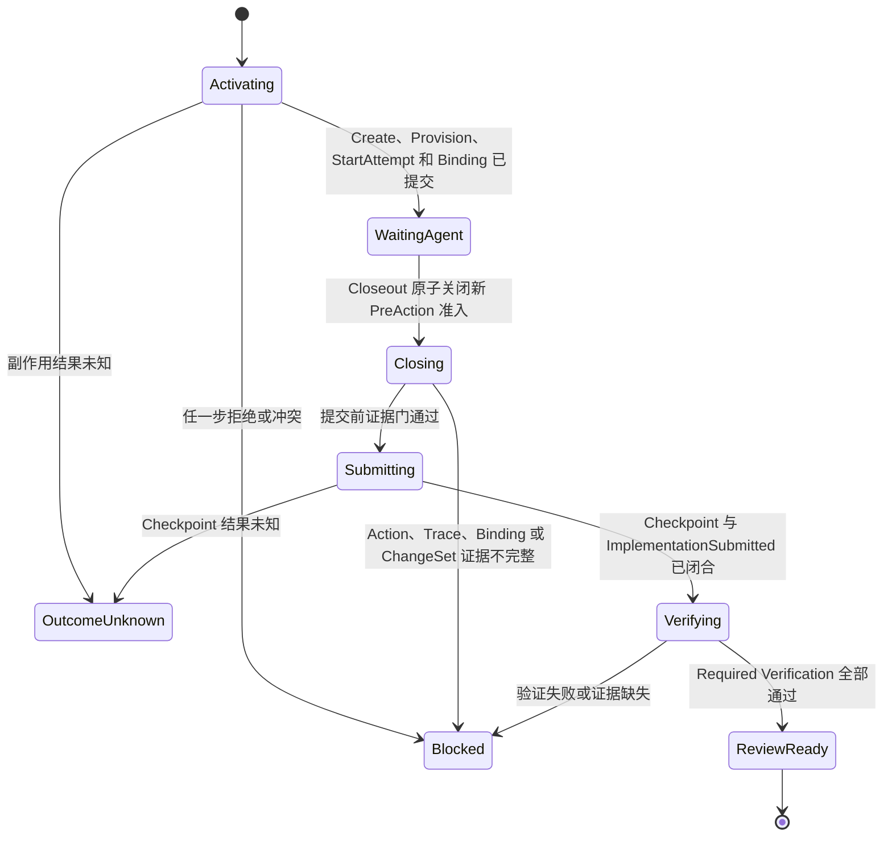

# 外部 Agent CodingTask Session

## 1. 状态

**状态：技术边界已确认，按可逆切片实施。** 当前 `cell run` 继续承担预编排 Mutation 的一次性确定性闭环；外部 Agent Session 使用独立协议，不改变 `coding-task.cell.run.v2` 的 Schema、执行顺序或公开语义。

S1 已交付 Session Activation、不可变 Activation Record/File Repository、`Create -> Provision -> StartAttempt` 后的权威读取、CLI `coding-task session activate`、跨实例复用和真实 Git E2E。S2 Session-bound Action Admission 也已实现：包含 Session Hook Binding v2、Admission State/File Store、非等待 Lease，以及 Activation 自动初始化 Binding/State。`waiting_agent` 仍只是技术检查点，不是独立写入授权；它表示 Session 可等待外部 Agent，但每个动作仍须通过 Admission。`beginClosing` 当前仅作为内部并发保护门存在；完整 Closeout 在提交前 ChangeSet、Checkpoint、Verification 和 PRReady 编排闭合前不开放。

## 2. 目标

外部 Agent Session 用于连接真实 Codex 编码动作与现有 CodingTask 确定性能力：

1. Human 已批准 Requirement、PlanRisk、Write Set 和必要的历史业务逻辑契约。
2. Harness 创建 CodingTask、受管 Worktree 和单一 Active Attempt。
3. Codex 只能在 Session-scoped Hook Binding 下执行已授权文件动作。
4. Closeout 先关闭新动作准入，再复验实际变更、Action、Trace 和绑定证据。
5. 证据完整后才允许创建 Git Checkpoint、执行 Verification 并生成 PRReadyArtifact。

Session 不是 Agent Runtime、模型路由器、通用 Workflow DAG 或 Studio Builder。

## 3. 为什么不扩展 Cell Run

`CodingTaskCellService` 的语义是没有外部停顿点的固定串行协议：

```text
Create -> Provision -> StartAttempt -> Implementation -> Submission -> Verification -> PRReady
```

外部 Agent 需要在 StartAttempt 与 Submission 之间跨进程暂停，并允许 Hook 动作持续进入。把暂停状态、并发动作和 Closeout 屏障放入 `cell run` 会改变现有幂等协议，并让预编排 Mutation 与外部 Agent 两种信任模型混杂。

因此新增 `codingTaskSession` Application 模块，并复用现有 Command Service、Repository Lock、Action Journal、Verification 和 PRReady 装配能力。

## 4. 生命周期



`OutcomeUnknown` 不自动重试。`Blocked` 或 `OutcomeUnknown` 不删除 Worktree，由 Human 按既有恢复流程处置。

## 5. Activation 契约

Activation Manifest 使用独立版本 `coding-task.session.activate.v1`，只包含：

- `sessionId`。
- CodingTask Create Command。
- Worktree Provision Command 与本次 Runtime Root。
- StartAttempt Command。

`agentActorId` 不属于 Manifest，必须由启动期 Runtime Binding 注入，并与三个命令信封中的 Agent Actor 精确复验。公开 CLI 的 `--root` 与 `--actor-id` 是操作员提供的启动声明，不构成身份认证或 Repository 授权；S1 CLI 因此只能作为受控操作员入口，不能暴露给不受信 Agent。S2 Composition Root 测试使用显式可信 Runtime Binding；进入真实 Pilot 前，企业包装器或持久化 Registry 仍必须从 Human 已批准配置注入 Repository Root 与 Actor 身份。

Manifest 不允许包含 Implementation、Submission 或 Verification。Activation 成功后必须从权威 CodingTask Aggregate 重建 Session Binding，禁止信任调用方重复提交以下字段：

- `sourceTaskId`。
- `codingTaskId`。
- `attemptNumber` 与 `attemptStartedAt`。
- `repositoryId`。
- `worktreeId` 与受管 Worktree Root Digest。
- PlanRisk Artifact ID 与 Digest。
- Agent Actor ID。

Session Binding 是不可变内容寻址记录。相同 `sessionId` 和相同 Binding Digest 幂等复用；相同 `sessionId` 对应不同 Binding 必须 Conflict。

## 6. Session-scoped Hook Binding

Legacy Hook Binding 只绑定 RequirementWorkflow Task、PlanRisk 和 Workspace Root，不能作为 Session Closeout 证据。

Session Binding 必须额外绑定：

- `sessionId`。
- `codingTaskId`。
- `attemptNumber`。
- `worktreeId`。
- `worktreeRootDigest`。
- Session Binding Digest。

S2 已实现：Hook PreAction 只有在 Session 状态为 `waiting_agent` 且全部身份精确一致时才可准入并写入 Action Intent；S1 的 `waiting_agent` 本身不产生该权限。PreAction 在同一 Lease 内复验 Activation、Binding、Runtime Provenance、PlanRisk/G2/G4/Write Set，Admission State 先记录 `pending`，再提交健康 v2 Intent，最后提交 `admittedActionIds`；Intent 已提交但最终状态写入不确定时进入 `outcome_unknown`。`IntentRecorded` 表示 v2 Intent 已耐久记录，不等于 Action 已完成或可以绕过 PostAction。Closeout 把 Session 原子迁移到 `closing` 后，任何新的 PreAction 都必须拒绝；已经准入但未完成 PostAction 的 Action 会阻断 Closeout。PostAction 在 `waiting_agent` 或 `closing` 中均可处理已准入 Action，但必须复验对应 v2 Intent，并写入 Trace、v2 Observation 与受其因果绑定的 Resolution；重复投递按 Action/Intent 身份幂等重放。Observation 或 Resolution 的提交结果不健康时，Admission State 即使已经处于 `closing` 也会进入 `outcome_unknown`。

## 7. Closeout 证据门

Closeout 不接受调用方自报的 changed paths、Attempt、PlanRisk 或 Worktree 身份。证据门在 Repository Lock 内按以下顺序执行：

1. 从 Session Binding 和 CodingTask Aggregate 重建当前身份与 Attempt。
2. 关闭 Session Action Admission，禁止新的 PreAction。
3. 检查不存在 In-flight、WaitingHuman、OutcomeUnknown 或 RetryPermitted Action。
4. 在提交前读取受管 Worktree 实际变化，要求 Base、Branch 和 Worktree 身份未漂移。
5. 实际 changed paths 必须非空并完全位于 CodingTask Write Set。
6. 计算稳定 ChangeSet Digest，绑定路径、变化类型和目标内容摘要。
7. 每个实际路径必须由同 Session、同 Attempt、同 Worktree、同 PlanRisk 的 Committed Hook Action 覆盖。
8. 每个 Action 必须存在唯一 Trace Observation，且查询没有跳过损坏记录。
9. Git Checkpoint 在写入前后复验同一 ChangeSet Digest；任何漂移都停止提交。
10. Checkpoint changed paths 必须与门检快照逐项一致，之后才进入 Verification。

Trace 不决定业务授权，但外部 Session 将它作为强制审计完整性门。Trace 写入被丢弃、缺失、损坏或存在多义匹配时，Closeout 必须 fail closed。其他非 Session 路径继续保持 Trace best-effort 语义。

## 8. 直接写入限制

Codex Adapter 当前只接管 `apply_patch`。仅凭 Hook Action 不能证明同一路径的全部字节都来自该工具；如果宿主仍允许 Shell、脚本或其他工具直接写文件，路径覆盖证据无法区分同路径绕过。

因此外部 Session 在进入 Production 前必须满足至少一个条件：

1. 宿主权限策略经过负向测试，证明除受管 `apply_patch` 外的其他写能力均被拒绝。
2. 引入 OS 或 VCS 级写入拦截，并将最终 ChangeSet 与受管 Action 精确绑定。

条件未满足时，只能声明技术演练，不得声明强来源证明或生产闭环。

## 9. Port 与分层

Application 只能依赖以下边界：

- `CodingTaskSessionRepository`：持久化 Session Event、Binding 和状态迁移。
- `SessionActionEvidenceRepository`：在同一 Session 锁协议下完成 Action 准入、闭合和查询。
- `GitChangeSetInspectorPort`：读取提交前实际变化并生成稳定快照。
- `HookBindingStore`：按精确 Binding 身份读取 Session-scoped Binding。
- 既有 CodingTask、Action Journal、Trace、Repository Lock、Submission、Verification 与 Evidence Port。

Windows、POSIX 路径、Git 命令和文件锁实现必须位于 Infrastructure 的平台兼容层，Application 不直接读取 `actions.jsonl`、`traces.jsonl`、Hook Binding 文件或 Git 输出。

## 10. 实施切片

### S1 Activation（已实现）

- Session Domain、不可变 Activation Record 与 File Repository。
- Activate Use Case、`Create -> Provision -> StartAttempt` 和权威 Runtime Binding 读取。
- Session 级跨进程 Lease 覆盖首次读取、三个命令与最终记录持久化。
- 最终记录耐久化结果未知时返回 `outcome_unknown`，不允许自动重试。
- CLI `coding-task session activate`。
- 跨实例幂等复用和真实 Git E2E。
- `waiting_agent` 仅表示 Activation 技术检查点，不授予文件写入权限。

### S2 Action Admission（已实现）

- Session-scoped Hook Binding v2、Admission State/File Store 和非等待 Lease。
- Activation 自动初始化 Binding/State；Session 状态与 PreAction 在同一 Lease 内原子准入。
- `pending` 表示准入写入尚未完成；健康 v2 Intent 提交后才记录 `admittedActionIds`。
- `IntentRecorded` 只表示 Intent 已耐久记录，不表示执行完成；失败或持久化不确定时 fail-closed/`outcome_unknown`。
- PostAction 在 `waiting_agent`/`closing` 中处理已准入 Action，复验 Session Provenance 和 v2 Intent，写入显式 Targets、Trace、v2 Observation 与受其因果绑定的 Resolution，重放幂等。
- Observation 或 Resolution 的跨 Store 提交不确定时，Session 从 `waiting_agent` 或 `closing` 进入 `outcome_unknown`。
- Session Action 查询与 In-flight 关闭门；缺失 Post、WaitingHuman、RetryPermitted、pending 或未知结果都会阻止 beginClosing。
- Windows 的目录 `fsync` 兼容只在 Infrastructure 平台层把精确 `win32 + EPERM + fsync` 映射为等价耐久；其他 best-effort 结果仍为降级。

### S3 Closeout

- 提交前 ChangeSet Inspector。
- ChangeSet Digest 与 Git Checkpoint 双向绑定。
- Submission、Verification、Evidence 和 PRReady 编排。
- CLI `coding-task session closeout`。

### S4 Pilot Metrics

- Human Touch 区间。
- 自动化步骤占比。
- Retry、Rework、Gate 命中、误报和错误放行。
- 真实项目基线与 Pilot 对照报告。

## 11. 非目标

- 不自动 Merge、Push、Release、Deploy 或写 Wiki。
- 不实现通用 Agent Registry、Model Router、Skill Registry 或 Studio。
- 不实现多仓写入 Saga。
- 不把固定公开项目 Smoke、自动模拟 Approval 或本仓技术演练计作生产业务试点。
- 不因追求自动化率放宽历史业务逻辑、跨仓、Rule Exception 或 Verification Human Gate。
