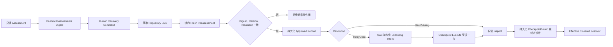
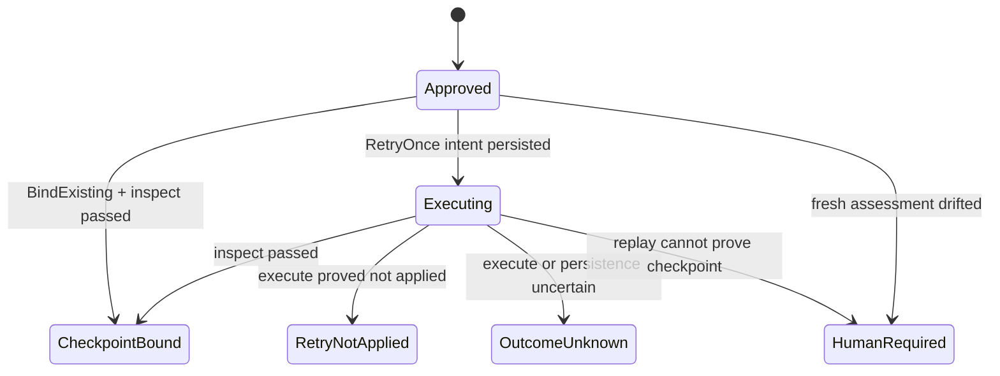

# CodingTask Session Closeout Human-gated 恢复

**状态：只读 Assessment、Recovery Process State、File Store、Human Command Contract 与锁内 Handler/Service 已实现；Effective Resolver、Composition Root/CLI 接线和真实 Git 恢复 E2E 尚未实现。Closeout State v3 的终态语义保持不变。**

## 1. 决策

`Blocked` 和 `OutcomeUnknown` 不能通过原 Closeout Command 重放恢复。恢复使用独立的 `CloseoutRecovery` Process Record，并由只读 Effective Resolver 在未来向 Submission 投影可消费的 `CheckpointBound`。

不选择修改 `closeout.json` 的原因：

- v3 已把 `Blocked`、`OutcomeUnknown` 和 `CheckpointBound` 定义为不可继续推进的终态。
- 让终态重新进入执行态会破坏既有 successor、版本、CLI 和持久化兼容语义。
- Human 授权、Assessment、执行 Intent 和恢复结果需要独立审计，不能混入原 Agent Closeout Command。
- 独立记录可以整体下线而不删除审计事实，也不影响原 Closeout 的 fail-closed 行为。

## 2. 固定协议



Assessment 与 Human Command 之间允许现场变化，但变化必须导致锁内摘要冲突，不能自动接受“足够接近”的结果。

## 3. 只读 Assessment

Assessment 必须绑定：

- Workspace、Session、CodingTask、Repository 和受管 Worktree 身份。
- 原 Closeout State 的 canonical digest、version、status、stopped stage 和 error code。
- Snapshot Digest、Coverage Binding Digest、base revision 和 Write Set。
- Checkpoint 的 `Absent`、`Present` 或 `Unknown` 三态现场结论。
- 当前唯一允许的 Resolution 与稳定诊断。

Assessment Digest 只覆盖规范化正文，不覆盖自身 digest 或由 digest 派生的 Evidence ID。

允许的 Assessment 结论：

| Closeout 现场                                                                                       | 结论                                 |
| --------------------------------------------------------------------------------------------------- | ------------------------------------ |
| `Blocked@SnapshotPersisted` 且错误为 `CheckpointNotApplied`，Checkpoint 明确不存在，Snapshot 未漂移 | 允许 `RetryOnce`                     |
| `OutcomeUnknown@SnapshotPersisted`，已存在 Checkpoint 且完整 ChangeSet 复验通过                     | 允许 `BindExisting`                  |
| `OutcomeUnknown@CheckpointBound`，保留的 Checkpoint 可重新完整复验                                  | 允许 `BindExisting`                  |
| `OutcomeUnknown@Closing`                                                                            | `HumanRequired`，禁止创建执行 Intent |
| Checkpoint、Snapshot、Coverage、Root、Branch、Write Set 或摘要任一不明确                            | `HumanRequired`                      |

`Unknown` 不等于 `Absent`。只有底层三态 Assessment 明确返回 `Absent`，才允许 Human 选择一次 `RetryOnce`。

## 4. Human Command

Recovery Command 必须是完整 Command Envelope，并满足：

- `actor.kind = human`。
- `commandType = coding_task_session.closeout.recover.v1`，Aggregate Type 固定为 `coding_task_session`。
- `aggregateId` 等于 Session ID。
- `expectedVersion` 精确绑定原 Closeout State version。
- Payload 只包含 `workspaceId`、`sessionId`、`expectedAssessmentDigest` 和 `requestedResolution`。
- `requestDigest` 与严格 Payload 规范摘要一致。

严格 parser 只验证 Envelope 与规范 Payload，不在锁外猜测 `expectedVersion` 是否仍匹配现场。`expectedVersion`、`expectedAssessmentDigest` 与 `requestedResolution` 必须在 Repository Lock 内 fresh reassessment 后共同复验，任一漂移都保持零执行副作用。

锁内处理使用以下固定决策：

| Recovery State     | Resolution     | 锁内动作                                                                                | `execute`              |
| ------------------ | -------------- | --------------------------------------------------------------------------------------- | ---------------------- |
| 不存在             | 任一允许值     | Fresh 三元组精确匹配后 create-only `Approved v0`                                        | 否                     |
| `Approved`         | `BindExisting` | 使用 fresh Assessment 已完整复验的 Present Checkpoint，CAS 为 `CheckpointBound v1`      | 永不调用               |
| `Approved`         | `RetryOnce`    | Fresh Assessment 必须仍为 Absent；先 CAS 为 `Executing v1`                              | 仅本次 CAS winner 一次 |
| `Executing`        | `RetryOnce`    | 只读 assess/inspect；Present 时绑定，Absent/Unknown 或无法证明时进入 `HumanRequired v2` | 禁止调用               |
| 任一活动状态       | 现场漂移       | 已有 Record 时 CAS `HumanRequired`；尚无 Record 时直接拒绝                              | 否                     |
| 任一 Recovery 终态 | 任一值         | 返回既有结果，不覆盖、不迁移                                                            | 禁止调用               |

`Executing` 重放不能要求 fresh Assessment Digest 仍等于 Human Command 中的旧值，因为首次 Checkpoint 尝试本身可能把现场从 Absent 改为 Present。重放只允许复验 Recovery Record 的不可变命令、Closeout、Snapshot 与 ChangeSet 身份，再只读 inspect；旧 Assessment 只证明首次执行授权，绝不授权第二次 `execute`。

Resolution 使用封闭枚举：

- `bind_existing`：只读复验已经存在的 Checkpoint，绝不调用 execute。
- `retry_once`：只适用于明确 `NotApplied` 且 Checkpoint 明确不存在的现场。

任何其他 Human 文本只能作为外部说明，不能成为状态机输入。

## 5. Recovery Process State

独立 Recovery Record 使用以下状态：



关键不变量：

1. 原 `closeout.json` 的字节、version 和 status 永不修改。
2. `RetryOnce` 必须先把 `Executing` Intent 通过 CAS 持久化，再调用 Checkpoint execute。
3. `Executing` 的任何重放只能 assess/inspect，禁止再次 execute。
4. `BindExisting` 的全部路径都禁止 execute。
5. `CheckpointBound` 必须保存完整 `ChangeSetCheckpoint`、原 Closeout Digest、Assessment Digest 和 Human Actor。
6. 同一原 Closeout Digest 最多存在一个恢复 Process Record；不同命令身份不能覆盖。
7. 结果写入未知时保留 `Executing` 或 `OutcomeUnknown`，不能推断成功或许可第二次执行。
8. Checkpoint 必须匹配 Process State 锁定的提交前 Snapshot 与 ChangeSet；`BindExisting` 还必须匹配 Assessment 已复验的 Checkpoint Binding。
9. `RetryNotApplied` 与 `OutcomeUnknown` 只能携带各自对应的稳定错误码，禁止状态与诊断相互矛盾。

Process State 保存已经由严格 Human Command parser 验证的 `requestDigest`，并在全部 successor 中保持不可变。Command Payload Schema 与 canonical 摘要重算由 Human Command 模块统一负责；State 与 Store 不重复解析 Command，只负责严格重建、身份连续性与 CAS。

## 6. 持久化

稳定路径：

```text
<storeRoot>/workspaces/<workspaceId>/codingTaskSessions/<sessionId>/
  closeout.json
  closeoutRecovery.json
  .closeoutRecovery.lock
```

Recovery Store 复用 canonical JSON、create-only 初始化、短时文件锁、`expectedVersion` CAS、原子替换、父目录耐久化和读后复验。Repository Lock 覆盖锁内 reassessment、Intent、Checkpoint 和结果闭合；文件锁只保护 Recovery Record 的单次本地变更。

File Store 已实现以下关闭式语义：

- 只允许 `Approved v0` 初始化；相同恢复身份复用现有进度，不同身份返回显式冲突。
- `replace` 在独立文件锁内重读 current，校验精确 `expectedVersion` 与合法 successor，再原子替换并读后复验。
- 写入开始后的文件替换、父目录耐久化或读后复验异常统一返回 Recovery 专属 `CommitOutcomeUnknown`，禁止隐式重试。
- 文件锁释放结果未知返回 Recovery 专属稳定错误码，并保留锁内操作原始失败。
- `IoFailure`、读取期实体漂移与内容损坏保持不同错误语义；相邻 `closeout.json` 不被读取或修改。

当前路径校验与共享 File Store 一致，会拒绝校验时可见的符号链接和目录联接；“校验完成后祖先目录被并发替换”的 TOCTOU 风险尚未由共享文件基础设施关闭。该风险不能在 Recovery Store 内混入平台特判，必须作为共享路径句柄/no-follow 能力独立设计并在不可信目录真实 Pilot 前完成。

## 7. Effective Resolver

后续 Submission 不直接判断“原 Closeout 或 Recovery 哪个成功”，只消费 Effective Resolver：

- 原 Closeout 为 `CheckpointBound` 时直接返回原 Checkpoint。
- 原 Closeout 为终态且存在精确绑定的 Recovery `CheckpointBound` 时返回恢复 Checkpoint。
- Recovery Record 缺失、非终态、摘要漂移或身份不一致时返回 unresolved。

本切片只定义并测试 Resolver，不提前修改 Submission、Verification 或 PRReady。

## 8. 实现顺序

1. 已完成 ChangeSet Checkpoint 只读三态 Recovery Port。
2. 已完成 Closeout Recovery Assessment 与 canonical digest。
3. 已完成独立 Recovery Process State、精确状态可达性与 successor 校验。
4. 已完成 Recovery Process File Store、create-only 初始化、CAS、严格重建与未知结果分类。
5. 已完成 Human Command Contract、严格 parser 与 canonical request digest 重算。
6. 已完成 Repository Lock 内 fresh reassessment、create-only/CAS 状态推进、至多一次 Checkpoint 执行、Executing 只读恢复和 Command Gateway Service。
7. 下一步实现 Effective Resolver。
8. 接入 CLI、故障注入、真实 Git E2E 和恢复 SOP。

每个切片必须独立提交，并保持原 Closeout v3、CLI Exit Code 和真实 Git E2E 全部回归通过。

## 9. 明确不做

- 不自动重试 `OutcomeUnknown`。
- 不允许 Human 直接写入 checkpoint、digest、Snapshot 或 Recovery State。
- 不增加 Artifact 过期算法；现场变化由精确 Assessment Digest 和版本冲突处理。
- 不在本阶段接入多仓补偿、后台 Worker、Submission 或真实 Codex Pilot。
- 不重写共享 File Lock 的历史替换风险；该问题必须独立评审。
