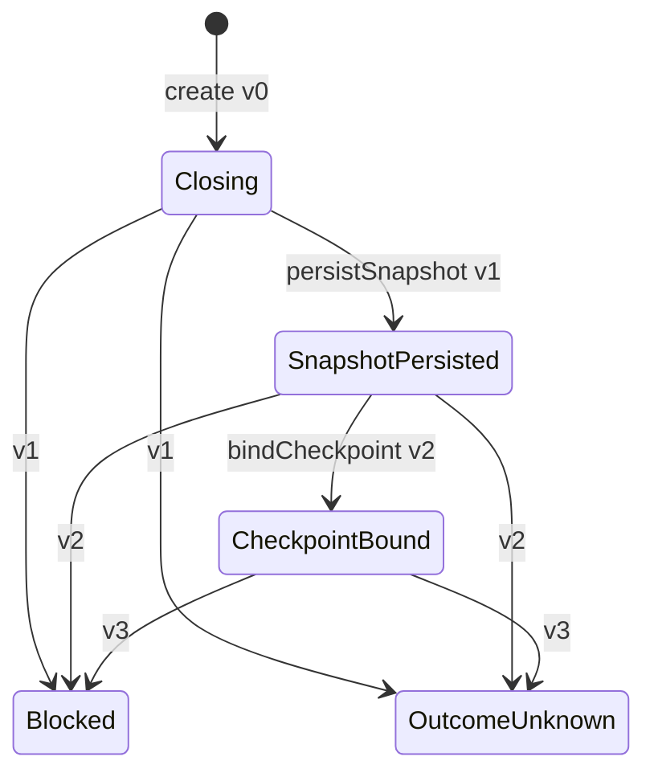

# CodingTask Session Closeout 状态持久化

**状态：Closeout State v3、Action targets 覆盖绑定、File Store、CodingTaskSessionCloseoutManager、生产 CLI 和真实 Git E2E 已实现；Manager 严格停止在 CheckpointBound。**

## 1. 目标与边界

Closeout 必须在 Git 副作用前留下可恢复的提交前事实，并在 Git Checkpoint 后保存可独立复验的绑定结果。本切片提供 Application 级 Process State、Infrastructure File Store 和可恢复的 Closeout Process Manager，不新增第三个 Domain Aggregate。

已实现：

- 持久化完整 `CodingTaskSessionChangeSetSnapshot` 和完整 `CodingTaskSessionActionCoverageManifest`，不保存 raw Journal/Trace payload。
- Closeout State 升级为 `coding-task-session.closeout-state.v3`，由 `coverageManifest` 唯一派生 Action ID，并以 `coverageBindingDigest` 绑定 Snapshot 摘要和 Manifest 摘要；Coverage binding schema 仍为 v1，生命周期 version 数字不变。
- Coverage Manifest 使用 `coding-task-session.action-coverage.v2`；每个 Action 的冻结 targets 只由已复验 Journal v2 Intent.targets 投影，并纳入 manifest digest。
- `persistSnapshot` 从 `Closing` 一次性严格重建 Snapshot 与 Manifest，验证 Workspace、Session、CodingTask、来源 Task、Repository、Attempt、Activation/Session Binding 以及 Snapshot Repository/Worktree 一致后迁移到 `SnapshotPersisted`。
- 保存并复验 `ChangeSetCheckpoint`、ChangeSet Digest、Snapshot Digest 和 changed paths。
- `snapshot.changedPaths` 必须是 Action targets union 的子集，且每个 Action target 必须精确属于 Snapshot `writeSet`；Write Set 内获准但没有最终 diff 的额外 target 允许存在。
- Rename 规范化后的原路径与目标路径都按普通 changed path 分别覆盖；Copy 只覆盖实际新增的目标路径，不把未变化的来源路径计入 changed paths。
- create-only 初始化、严格 canonical JSON 重建、跨进程短时锁和 `expectedVersion` CAS。
- 写入结果未知与 Lock 释放结果未知的独立错误分类。
- `CodingTaskSessionCloseoutManager` 已接入 `HarnessApplication`：在 Repository Lock 内 fresh 读取 Activation、CodingTask、Session Hook Binding、Repository Root 和 Managed Worktree，校验 Command Actor、时间、Attempt、Gate 与完整身份；幂等 `load/create` Closeout State 后依次执行 `beginClosing`、Action Coverage、权威 Snapshot、`persistSnapshot`、ChangeSet-bound Checkpoint 的 execute + inspect 和 `bindCheckpoint`，严格停止在 `CheckpointBound`。
- CLI `coding-task session closeout` 读取完整 Closeout Command Envelope，并要求 Workspace、Repository、绝对 Root 与 Agent Actor 的显式运行时绑定。CLI 不生成 ID、时间或摘要；`CheckpointBound`、`Blocked` 与 `OutcomeUnknown` 分别映射为成功、冲突和专用未知结果。
- 真实 Git E2E 通过生产 API 建立 Task、Human Gate、Activation、Binding、Admission、Journal 和 Trace，在真实受管 Worktree 中产生 Write Set 内变更，再通过生产 CLI 创建唯一 ChangeSet-bound Checkpoint；新 Application 重放同一 Command 后，HEAD、Commit 数量和关键持久化证据原始字节均不变化。

未实现：

- `Blocked` / `OutcomeUnknown` 的只读 Assessment、Human-gated 显式恢复命令和恢复 SOP 自动化。
- Submission、Verification、PRReady 串联、真实 Codex Pilot 和多仓交付编排。

Coverage Proof 的严格身份、Journal v2 provenance、Trace observation digest 精确集合匹配和 fail-closed 规则不改变现有 Human Gates、多仓写入、Wiki 写入或知识候选晋升边界。

## 2. 状态机



不新增 `CoverageProved` 状态。`stoppedStage` 不由调用方填写，而是从进入终态前的活动状态自动推导。`Blocked` 与 `OutcomeUnknown` 都是终态，不能继续推进。精确版本同时阻止调用方构造一个 `version=1` 的 `CheckpointBound` 来跳过 Snapshot 持久化。

## 3. 持久化不变量

1. Workspace、Session、CodingTask、来源 Task、Repository、Attempt、Activation/Session/Request Digest、幂等键、命令因果链和 Actor 在 replace 前后不可变。
2. `Closing` 只能是 `version=0`，且 `snapshot`、`coverageManifest`、`coverageBindingDigest` 和 Checkpoint 必须为空。
3. `SnapshotPersisted` 固定为 `version=1`；Snapshot、完整 Coverage Manifest 和外层绑定摘要必须同时存在，且绑定输入固定为 `{schemaVersion, snapshotDigest, manifestDigest}`。
4. Coverage Manifest 的 Workspace、Session、CodingTask、来源 Task、Repository、Attempt、Activation Binding、Session Binding 必须与 Closeout 一致；Manifest Repository 和 Worktree 必须与 Snapshot 一致。每个 Action target 必须来自对应 Journal v2 Intent.targets，并通过路径规范化、排序去重和 digest 校验。
5. `CheckpointBound` 固定为 `version=2`，Checkpoint 必须与完整 Snapshot 的 ChangeSet Digest、Snapshot Digest 和 changed paths 一致，并保留同一份 Coverage Manifest 与外层绑定。
6. 终态版本和已保留证据必须与自动记录的 `stoppedStage` 一致；合法 successor 不得替换 Manifest 或外层绑定。
7. `errorCode` 只能来自 `HarnessErrorCode` 枚举；未知字段、未知枚举值、摘要漂移和时间倒退全部关闭式拒绝。
8. 文件内 Workspace/Session 必须与 Store 路径 Locator 一致；把另一 Session 的合法 State 复制到目标目录仍按 `CorruptStore` 拒绝。

## 4. File Store

Store 使用以下稳定路径：

```text
<storeRoot>/workspaces/<workspaceId>/codingTaskSessions/<sessionId>/
  closeout.json
  .closeout.lock
```

`closeout.json` 保存 canonical v3 State、完整 Coverage Manifest v2、`manifestDigest` 和 `coverageBindingDigest`，不保存 raw Journal/Trace payload。读入时严格重算 Manifest、Action target 覆盖和外层绑定。

初始化在内部短时 Lock 内执行 create-only 发布。同一不可变请求身份即使已经推进到后续阶段，也返回现有 State 和 `Reused` 供恢复；相同 Session 下的不同请求身份返回 `Conflict`，不会覆盖既有状态。

replace 在同一个 Lock 内重新读取当前文件并执行 `expectedVersion` CAS，再验证候选状态是当前状态的合法后继且没有替换已持久化证据，最后通过 `write-file-atomic` 完成文件 `fsync`、原子替换、父目录耐久化和读后复验。调用方持有的旧版本不能覆盖新版本。

旧 v1 弱证据和旧 v2 嵌套 Coverage Manifest v1 都不会自动升级，也不会覆盖旧文件。旧 v2 必须由独立 classifier 校验 exact keys、identity/locator、Snapshot、旧 manifest 及 digest、外层 binding、Checkpoint、时间、阶段和 version；完整自洽旧 v2 返回 `PreconditionNotMet` 并保持 bytes，unknown field、摘要/绑定/locator/阶段漂移、结构损坏仍返回 `CorruptStore`。当前 v3 rebuild 不调用旧 manifest 的升级后 validator。

## 5. 失败与恢复语义

| 情况                             | 稳定结果                                        |
| -------------------------------- | ----------------------------------------------- |
| Lock 已被占用                    | `LockUnavailable`，不等待、不自动重试           |
| expectedVersion 已变化           | `VersionConflict`，重新 load 后决策             |
| 写入开始后无法证明提交结果       | `CodingTaskSessionCloseoutCommitOutcomeUnknown` |
| Lock 释放是否成功无法确认        | `CodingTaskSessionCloseoutLockReleaseUnknown`   |
| JSON、Schema、摘要或文件类型损坏 | `CorruptStore`                                  |
| Store 路径包含不受支持的链接     | `OperationForbidden`                            |

`CommitOutcomeUnknown` 与 `LockReleaseUnknown` 不能降级为普通 I/O 失败。后续恢复流程必须先只读检查 State 和 Lock，再由 Human 或确定性恢复命令决定是否继续。

Manager 在副作用前遇到只读 `IoFailure` 或 `LockUnavailable` 时保持可安全重试；确定性前置失败落 `Blocked`。Checkpoint 执行、State commit 或 Lock release 结果无法证明时落 `OutcomeUnknown`，或返回稳定不可重试错误。

普通 Closeout Command 只允许活动状态继续推进；`Blocked` 和 `OutcomeUnknown` 的重放保持终态且不再次执行 Checkpoint。后续恢复必须先生成绑定原状态版本与真实 Git 现场的 canonical Assessment，再由 Human Command 绑定 Assessment Digest；任何状态、Snapshot、Coverage、Checkpoint 或工作树漂移都必须关闭式拒绝。

## 6. 复用与残余风险

本切片复用既有 `write-file-atomic`、`createOnlyImmutableFile`、`ExclusiveFileLockManager`、strict JSON reader、canonical JSON 和平台耐久层，没有重新实现原子写入或 Windows 目录 `fsync` 兼容。

共享 `ExclusiveFileLockManager` 当前仍存在独立的历史风险：若外部进程在持锁期间删除并替换 Lock 文件，旧句柄释放时可能删除替换后的路径；目录检查也无法消除拥有本机写权限的对手在检查后的替换竞争。本切片不静默修改该公共锁实现。修复它会影响所有 File Store，必须作为独立高风险变更接受 Human 评审和全仓故障注入。

## 7. 下一切片

下一步应为 Human-gated Closeout Recovery：先只读评估终态与真实 Checkpoint，再由绑定精确 Assessment Digest 和 Closeout Version 的 Human Command 对账；不得把未知结果改写成自动重试。恢复边界完成后，再接入 Submission、Verification、Evidence 和 PRReady 串联、真实 Codex Pilot 与多仓交付编排。
