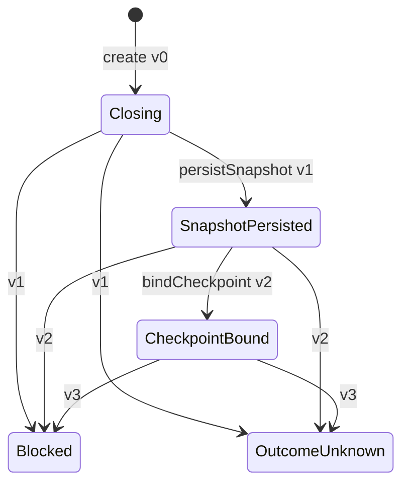

# CodingTask Session Closeout 状态持久化

**状态：状态机与 File Store 基础已实现；完整 Closeout Process Manager 尚未实现。**

## 1. 目标与边界

Closeout 必须在 Git 副作用前留下可恢复的提交前事实，并在 Git Checkpoint 后保存可独立复验的绑定结果。本切片提供 Application 级 Process State 和 Infrastructure File Store，不新增第三个 Domain Aggregate，也不代替后续 Process Manager。

已实现：

- 持久化完整 `CodingTaskSessionChangeSetSnapshot`，不只保存摘要或调用方自报路径。
- 将规范 Action ID 集合和 Snapshot 绑定为 `actionEvidenceDigest`。
- 保存并复验 `ChangeSetCheckpoint`、ChangeSet Digest、Snapshot Digest 和 changed paths。
- create-only 初始化、严格 canonical JSON 重建、跨进程短时锁和 `expectedVersion` CAS。
- 写入结果未知与 Lock 释放结果未知的独立错误分类。
- 独立的 CodingTask Session Action/Trace Coverage Proof Application 能力；该能力尚未绑定本 Closeout State 或 Process Manager。

未实现：

- 由 Closeout State 消费 Coverage Proof 并在 Process Manager 中编排其结果。
- 在 Repository Lock 内驱动 Snapshot、Git Checkpoint、Submission、Verification 和 PRReady。
- Closeout 恢复 Use Case、CLI、真实 Codex Pilot 和多仓交付编排。

Coverage Proof 的严格身份、Journal v2 provenance、Trace observation digest 精确集合匹配和 fail-closed 规则不改变现有 Human Gates、多仓写入、Wiki 写入或知识候选晋升边界。

## 2. 状态机



`stoppedStage` 不由调用方填写，而是从进入终态前的活动状态自动推导。`Blocked` 与 `OutcomeUnknown` 都是终态，不能继续推进。精确版本同时阻止调用方构造一个 `version=1` 的 `CheckpointBound` 来跳过 Snapshot 持久化。

## 3. 持久化不变量

1. Workspace、Session、CodingTask、来源 Task、Repository、Attempt、Activation/Session/Request Digest、幂等键、命令因果链和 Actor 在 replace 前后不可变。
2. `Closing` 只能是 `version=0`，且 `updatedAt` 必须等于 `createdAt`。
3. Snapshot 与非空 Action Evidence 必须同时存在；Action ID 唯一并按字典序持久化。
4. `SnapshotPersisted` 固定为 `version=1`，不得包含 Checkpoint。
5. `CheckpointBound` 固定为 `version=2`，Checkpoint 必须与完整 Snapshot 的 ChangeSet Digest、Snapshot Digest 和 changed paths 一致。
6. 终态版本和已保留证据必须与自动记录的 `stoppedStage` 一致。
7. `errorCode` 只能来自 `HarnessErrorCode` 枚举；未知字段、未知枚举值、摘要漂移和时间倒退全部关闭式拒绝。
8. 文件内 Workspace/Session 必须与 Store 路径 Locator 一致；把另一 Session 的合法 State 复制到目标目录仍按 `CorruptStore` 拒绝。

## 4. File Store

Store 使用以下稳定路径：

```text
<storeRoot>/workspaces/<workspaceId>/codingTaskSessions/<sessionId>/
  closeout.json
  .closeout.lock
```

初始化在内部短时 Lock 内执行 create-only 发布。同一不可变请求身份即使已经推进到后续阶段，也返回现有 State 和 `Reused` 供恢复；相同 Session 下的不同请求身份返回 `Conflict`，不会覆盖既有状态。

replace 在同一个 Lock 内重新读取当前文件并执行 `expectedVersion` CAS，再验证候选状态是当前状态的合法后继且没有替换已持久化证据，最后通过 `write-file-atomic` 完成文件 `fsync`、原子替换、父目录耐久化和读后复验。调用方持有的旧版本不能覆盖新版本。

## 5. 失败与恢复语义

| 情况                             | 稳定结果                                        |
| -------------------------------- | ----------------------------------------------- |
| Lock 已被占用                    | `LockUnavailable`，不等待、不自动重试           |
| expectedVersion 已变化           | `VersionConflict`，重新 load 后决策             |
| 写入开始后无法证明提交结果       | `CodingTaskSessionCloseoutCommitOutcomeUnknown` |
| Lock 释放是否成功无法确认        | `CodingTaskSessionCloseoutLockReleaseUnknown`   |
| JSON、Schema、摘要或文件类型损坏 | `CorruptStore`                                  |
| Store 路径包含不受支持的链接     | `OperationForbidden`                            |

`CommitOutcomeUnknown` 与 `LockReleaseUnknown` 不能降级为普通 I/O 失败。后续恢复流程必须先只读检查 State 和 Lock，再由 Human 或确定性恢复命令决定是否继续。

## 6. 复用与残余风险

本切片复用既有 `write-file-atomic`、`createOnlyImmutableFile`、`ExclusiveFileLockManager`、strict JSON reader、canonical JSON 和平台耐久层，没有重新实现原子写入或 Windows 目录 `fsync` 兼容。

共享 `ExclusiveFileLockManager` 当前仍存在独立的历史风险：若外部进程在持锁期间删除并替换 Lock 文件，旧句柄释放时可能删除替换后的路径；目录检查也无法消除拥有本机写权限的对手在检查后的替换竞争。本切片不静默修改该公共锁实现。修复它会影响所有 File Store，必须作为独立高风险变更接受 Human 评审和全仓故障注入。

## 7. 下一切片

下一步由 Closeout Process Manager 在 Repository Lock 内执行：

1. 原子关闭 Session 新 Action 准入。
2. 调用独立 Coverage Proof，重建 Action、Observation、Resolution 和 Trace 的完整覆盖证明。
3. 获取权威 ChangeSet Snapshot，创建并持久化 `SnapshotPersisted`。
4. 执行或只读恢复 ChangeSet-bound Git Checkpoint，持久化 `CheckpointBound`。
5. 接入 Submission、Verification、Evidence 和 PRReady，并提供确定性恢复入口。
