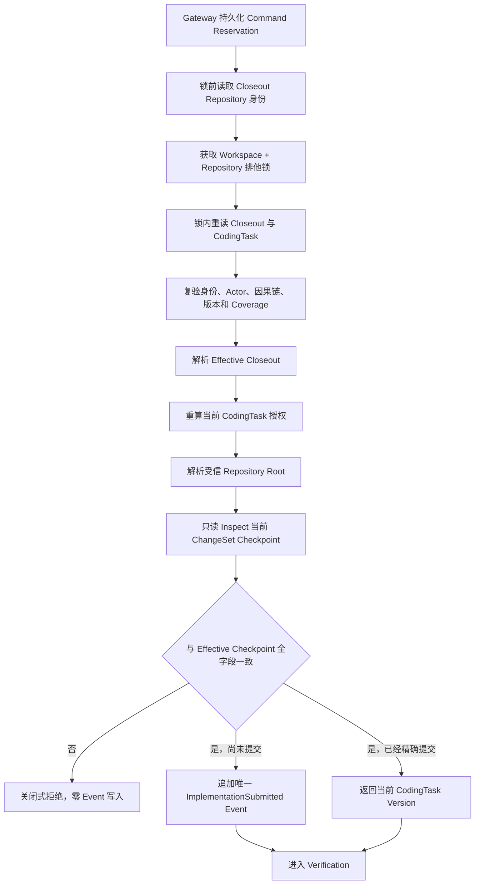

# CodingTask Session Delivery Submission

**状态：Application Command、锁内 Handler、Composition Root、Original/Recovery 真实 Git E2E 已实现；尚未提供独立 CLI，也未串联自动 Verification、Evidence、PRReady 或真实 Codex Pilot。**

## 1. 目标

Session Closeout 已经创建并绑定唯一 Git Checkpoint，但 `CodingTask` 仍停留在活动的 Implementation Attempt。Delivery Submission 负责把 Effective Closeout 接纳为唯一 `ImplementationSubmitted` Event，使 CodingTask 进入 Verification。

该入口不创建第二个 Git Commit，也不创建新的 Action Journal。继续调用既有 `ImplementationSubmissionService` 会重复负责 Git 副作用和 Action Journal，无法表达“Closeout 已经完成提交”的事实，因此本切片只复用其下游 Domain Event 语义和内部能力。

## 2. 命令契约

外部命令固定为 `coding_task_session.delivery.submit.v1`：

- Aggregate 固定为目标 `coding_task`，`expectedVersion` 绑定当前 CodingTask。
- Actor 固定为原 Closeout Agent；Human Decision 仍在 PlanRisk、历史业务逻辑确认和 Recovery Gate 中完成。
- `causationId` 必须等于原 Closeout Command ID，`correlationId` 必须保持一致。
- Payload 只允许 `workspaceId`、`sessionId`、`expectedCheckpointBindingDigest` 和 `expectedEffectiveSource`。
- `requestDigest` 必须由上述四字段规范重算。
- `expectedEffectiveSource` 只能是 `original` 或 `recovery` 封闭枚举。

调用方必须先读取 Effective Closeout，再明确绑定来源和 Checkpoint 摘要。Handler 不接受调用方自报的 Revision、Changed Paths 或 Repository Root。

## 3. 锁内流程

锁内会再次比较锁前和锁内的 Workspace/Repository 身份。状态文件被替换到其他仓库时，Handler 拒绝继续，不能在错误的 Repository Lock 下执行。

## 4. Human Gate

Delivery 不新增绕过审批的权限：

1. Closeout State 必须已经保存完整 Snapshot、Action Coverage 与绑定摘要。
2. Effective Resolver 只接受原 `CheckpointBound`，或经 Human-gated Recovery 精确绑定的 Checkpoint。
3. CodingTask Authorization Resolver 在锁内根据当前 Task、Write Set、PlanRisk 和历史业务逻辑标记重新授权。
4. 缺少历史业务逻辑确认、风险审批或其他必需 Gate 时，授权解析失败，Event 不会提交。
5. Delivery Actor 不能伪装成 Human；Human Approval 只能来自权威 Task/Approval 事实。

## 5. 幂等与恢复

- 相同外部 Command 由 Application Command Gateway 返回已持久化 Receipt，不重复进入 Handler。
- 不同 Command 在 CodingTask 已包含完全相同的 Attempt、Target Revision 和 Changed Paths 时，只返回当前版本，不追加第二条 Event。
- Event append 返回失败后，Handler 会重新读取 CodingTask；只有权威 Aggregate 已经包含同一个 Checkpoint 时才接纳为成功。
- Checkpoint、Source、Version、Actor、因果链、Snapshot、Coverage 或 Repository 身份任一漂移都关闭式拒绝。
- Repository Lock 释放结果未知时返回 I/O 不确定结果，不能把锁内成功猜测为稳定完成。

## 6. 复用边界

- 复用 `ApplicationCommandGateway` 的持久化 Reservation 与 Receipt。
- 复用 `CodingTaskSessionEffectiveCloseoutResolver` 的 Original/Recovery 投影。
- 复用 Closeout 的 Checkpoint Input Factory，确保 Commit Message、Worktree、Base Revision 和 Write Set 规则只有一个实现。
- 复用通用 `hasSameChangeSetCheckpoint` 全字段比较器。
- 复用 `CodingTaskCommandHandler` 的内部 capability，只追加领域 Event。
- 复用当前 Authorization Resolver、Repository Root Resolver、Repository Lock 和 ChangeSet Checkpoint Inspector。

没有引入新的 Agent 框架、Workflow Runtime、数据库或 Git 库。

## 7. 验证证据

当前测试覆盖：

- Agent Command 的严格 Schema、规范 UTC、四字段摘要、Actor、Aggregate 和 Version 约束。
- Effective Source、Binding Digest、因果链、版本和新鲜 Checkpoint 漂移的关闭式拒绝。
- Original Closeout 交付后仅有一个 Git Commit 和一条 `ImplementationSubmitted` Event。
- `OutcomeUnknown -> Human BindExisting -> Recovery` 交付沿用同一 Git Commit。
- 新 Composition Root 使用不同 Command 进入 Handler 级幂等路径，仍不产生第二条 Event。
- CodingTask 最终进入 Verification，Attempt 绑定真实 Target Revision 和 Changed Paths。

这些是确定性本地真实 Git 证据，不等于真实 Codex/企业 Pilot。

## 8. 下一步

下一切片消费已经进入 Verification 的 CodingTask，串联：

1. 权威 Verification Plan 选择与 Revision Binding。
2. Verification Command、EvidenceBundle 和失败恢复。
3. Required Check 完整后装配 PRReadyArtifact。
4. 上述闭合后再运行真实 Codex 项目 Pilot。

独立 Delivery CLI、Workflow 自动驱动、多仓交付和 Studio 可视化不在本切片范围内。
