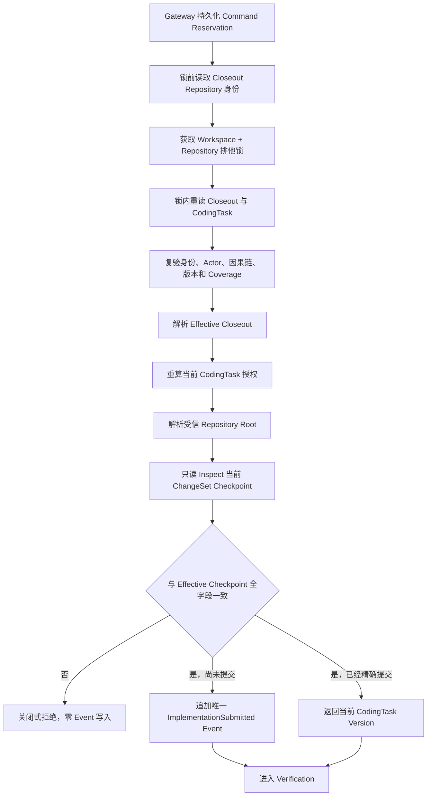
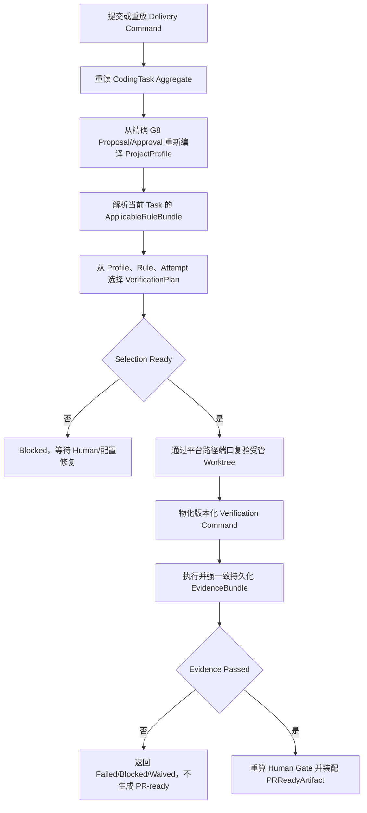

# CodingTask Session Delivery 与 Completion

**状态：Delivery Submission、权威 Plan 选择、Verification、Evidence、PR-ready 串联、独立 Completion CLI 和真实 Git E2E 已实现；真实 Codex 公开项目 Pilot 已通过。**

## 1. 目标

Session Closeout 已经创建并绑定唯一 Git Checkpoint，但 `CodingTask` 仍停留在活动的 Implementation Attempt。Delivery Submission 负责把 Effective Closeout 接纳为唯一 `ImplementationSubmitted` Event，使 CodingTask 进入 Verification。

该入口不创建第二个 Git Commit，也不创建新的 Action Journal。继续调用既有 `ImplementationSubmissionService` 会重复负责 Git 副作用和 Action Journal，无法表达“Closeout 已经完成提交”的事实，因此本切片只复用其下游 Domain Event 语义和内部能力。

`completeCodingTaskSessionDelivery` 在 Submission 成功后继续从权威 Store 重建 Profile、Rule、Plan 和 Verification Command，最终只在 Passed Evidence 与当前 Human Gate 同时成立时装配 `PRReadyArtifact`。它不增加新的流程 Store，也不接管 PR 创建、推送或合并。

## 2. 命令契约

外部命令固定为 `coding_task_session.delivery.submit.v1`：

- Aggregate 固定为目标 `coding_task`，`expectedVersion` 绑定当前 CodingTask。
- Actor 固定为原 Closeout Agent；Human Decision 仍在 PlanRisk、历史业务逻辑确认和 Recovery Gate 中完成。
- `causationId` 必须等于原 Closeout Command ID，`correlationId` 必须保持一致。
- Payload 只允许 `workspaceId`、`sessionId`、`expectedCheckpointBindingDigest` 和 `expectedEffectiveSource`。
- `requestDigest` 必须由上述四字段规范重算。
- `expectedEffectiveSource` 只能是 `original` 或 `recovery` 封闭枚举。

调用方必须先读取 Effective Closeout，再明确绑定来源和 Checkpoint 摘要。Handler 不接受调用方自报的 Revision、Changed Paths 或 Repository Root。

## 3. 锁内流程



锁内会再次比较锁前和锁内的 Workspace/Repository 身份。状态文件被替换到其他仓库时，Handler 拒绝继续，不能在错误的 Repository Lock 下执行。

## 4. Human Gate

Delivery 不新增绕过审批的权限：

1. Closeout State 必须已经保存完整 Snapshot、Action Coverage 与绑定摘要。
2. Effective Resolver 只接受原 `CheckpointBound`，或经 Human-gated Recovery 精确绑定的 Checkpoint。
3. CodingTask Authorization Resolver 在锁内根据当前 Task、Write Set、PlanRisk 和历史业务逻辑标记重新授权。
4. 缺少历史业务逻辑确认、风险审批或其他必需 Gate 时，授权解析失败，Event 不会提交。
5. Delivery Actor 不能伪装成 Human；Human Approval 只能来自权威 Task/Approval 事实。

## 5. Completion 权威链



调用方只提供 Profile Artifact 定位、Rule Resolution Context 和 Verification 调用元数据，不能提供最终 Plan、Attempt Number、Target Revision、Expected Version 或 Repository Root。Plan 固定包含 Profile Bundle、Repository Profile、Proposal Artifact、G8 Approval 和 Applicable Rule Bundle 的来源摘要；Evidence 再绑定完整 Plan Digest。

Project Profile 是 Workspace/Repository 级受管资产，允许复用另一个已完成 Task 中的 G8 Proposal。复用仍必须满足同 Workspace、当前 Repository/Base Revision、Proposal/Approval 精确绑定和完整 Profile/Rule Digest 校验；Rule Bundle 的 Task ID 必须等于当前 CodingTask 的来源 Task。

## 6. 幂等与恢复

- 相同外部 Command 由 Application Command Gateway 返回已持久化 Receipt，不重复进入 Handler。
- 不同 Command ID 复用同一幂等键时，只有首次结果为 `committed` 才返回 `duplicate`；首次 `rejected`、`conflict` 或 `outcome_unknown` 会保持原状态，不能借重复请求继续后续阶段。
- 不同 Command 在 CodingTask 已包含完全相同的 Attempt、Target Revision 和 Changed Paths 时，只返回当前版本，不追加第二条 Event。
- Event append 返回失败后，Handler 会重新读取 CodingTask；只有权威 Aggregate 已经包含同一个 Checkpoint 时才接纳为成功。
- Checkpoint、Source、Version、Actor、因果链、Snapshot、Coverage 或 Repository 身份任一漂移都关闭式拒绝。
- Repository Lock 释放结果未知时返回 I/O 不确定结果，不能把锁内成功猜测为稳定完成。
- Verification 明确失败后 Aggregate 会按失败分类回到 Implementation 或 WaitingHuman；同一完成输入仍可重建原 Plan、复用原 Receipt 并读取原 Evidence。
- `outcome_unknown` 在 Delivery 或 Verification 任一阶段都立即停止，不自动重跑，也不新增隐藏恢复协议。

## 7. 复用边界

- 复用 `ApplicationCommandGateway` 的持久化 Reservation 与 Receipt。
- 复用 `CodingTaskSessionEffectiveCloseoutResolver` 的 Original/Recovery 投影。
- 复用 Closeout 的 Checkpoint Input Factory，确保 Commit Message、Worktree、Base Revision 和 Write Set 规则只有一个实现。
- 复用通用 `hasSameChangeSetCheckpoint` 全字段比较器。
- 复用 `CodingTaskCommandHandler` 的内部 capability，只追加领域 Event。
- 复用当前 Authorization Resolver、Repository Root Resolver、Repository Lock 和 ChangeSet Checkpoint Inspector。
- 复用 `CompileProjectProfileUseCase`、`ResolveRulesUseCase` 和 `SelectVerificationPlanUseCase`，不接受调用方自报最终 Plan。
- 复用版本化 Verification Command、Evidence Store 和 PR-ready 装配器；兼容 Cell 与 Session Completion 共用同一窄尾链。
- 复用 `ManagedWorktreePathPort` 隔离 Windows/POSIX 路径身份语义，Application 不包含平台分支。

没有引入新的 Agent 框架、Workflow Runtime、数据库或 Git 库。

## 8. Completion CLI

受信宿主使用以下命令消费完整 Completion 输入：

```powershell
liushi-harness coding-task session complete --file .\sessionCompletion.json --workspace <workspace-id> --session <session-id> --repository <repository-id> --root <absolute-repository-root> --actor-id <agent-id> --verification-mode local_command --json
```

CLI 在 Application 副作用前复验 Workspace、Session、Delivery Actor 和 Verification Actor，并通过启动期 Composition Root 绑定唯一 Repository Root。输入缺失字段由现有严格 Application Schema 拒绝；存在但与 CLI 绑定不一致的字段立即返回 `PreconditionNotMet`。

CLI 不生成 ID、时间、摘要、Profile、Rule 或 Verification Plan。`local_command` 必须显式选择；`fail_closed_mock` 不运行项目命令。只有 `review_ready` 返回退出码 `0`，确定性阻断或验证失败返回 `4`，`outcome_unknown` 返回 `8` 且不得自动重试。

## 9. 验证证据

当前测试覆盖：

- Agent Command 的严格 Schema、规范 UTC、四字段摘要、Actor、Aggregate 和 Version 约束。
- Effective Source、Binding Digest、因果链、版本和新鲜 Checkpoint 漂移的关闭式拒绝。
- Original Closeout 交付后仅有一个 Git Commit 和一条 `ImplementationSubmitted` Event。
- `OutcomeUnknown -> Human BindExisting -> Recovery` 交付沿用同一 Git Commit。
- 新 Composition Root 使用不同 Command 进入 Handler 级幂等路径，仍不产生第二条 Event。
- CodingTask 最终进入 Verification，Attempt 绑定真实 Target Revision 和 Changed Paths。
- Passed 路径真实运行本地 `node --version`，持久化 Evidence，装配 PR-ready，并在重启后保持 Event/Evidence 字节不变。
- Failed 路径真实运行确定性失败命令，Aggregate 回到 Implementation；重启后精确重放同一 Failed Evidence，不重复 Commit 或 Event。
- Profile 必须在业务 Planning Artifact 之前完成 G8；测试不会放宽 Artifact 顺序或 `WorkspaceBusy`。
- Plan Source Refs 漂移、Evidence Plan Digest 漂移、Runtime Root 不匹配和未知 Receipt 均关闭式停止。
- 错误 Repository、Root、Delivery Actor 或 Verification Actor 在 Delivery Gateway 前关闭式拒绝；直接调用公开 Application 或经 CLI 调用时，真实 File Store 中的目标 Command Reservation、Aggregate、Event 与 Git Commit 均保持不变。

除确定性本地真实 Git 证据外，固定公开项目 Pilot 已使用真实 Codex App Server 完成同一 golden path。该结果仍不等于企业项目生产 Pilot，详细边界见 [Codex Agent Pilot 验证记录](./codexAgentPilotValidationRecord.md)。

## 10. 下一步

下一步固定为以脱敏企业需求运行同一 CLI 主线，采集 Human Touch Time、自动化步骤占比、Gate 命中和返工证据，并验证受信 Runtime Binding 的企业注入方式。

Workflow 自动驱动、多仓交付和 Studio 可视化不在本切片范围内。
