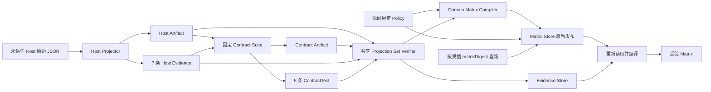

# Executor Compatibility Store 与 CLI

**状态：已实现。Host/Contract 双 Artifact、12 条 Evidence、内容寻址 Evidence/Matrix Store、关闭式重验、确定性 Publication Bundle、create-only 原子输出、P3a G6 Release Attestation Domain、生产 Composition Root 和公开 Compile/Query/Bundle Create CLI 已落地；真实 Codex CLI 0.144.5 已完成一次本机 v2 Host、Compile 与 Query，受信发布矩阵仍未实现。**

## 1. 目标

本切片把已经通过平台 Projector 验证的脱敏 Evidence、固定 Policy 和 Matrix 持久化，使调用方可以在进程重启后按精确 `matrixDigest` 查询并重新证明兼容性结论。

必须满足：

- CLI 只接收原始 Prepare Manifest、Activation Plan 和 Host Result，不接收调用方自报的 `Passed Evidence` 或 Contract Result。
- Codex Host Projector 继续负责完整 Schema、来源摘要、项目拓扑、Host 环境和正负向检查的关闭式验证，并固定生成七条 Host Evidence。
- Application 只用已验证 Host Projection 派生 Contract 的精确 Scope、父 Host Artifact Digest 与确定性观察锚点；固定 Suite 再生成独立 Contract Artifact 和五条 ContractTest。
- Policy 由源码中的固定工厂提供，CLI 不能提交或覆盖支持 Policy。
- Artifact、Evidence 和 Matrix 使用 RFC 8785 SHA-256 内容寻址；同一摘要只能表示同一规范内容。
- Matrix 是最后发布的不可变记录；只成功写入 Artifact 或 Evidence 不能形成支持声明。
- Query 必须重新读取 Policy、十二条 Evidence 和两份脱敏来源 Artifact，并调用 Domain Compiler 重编译；禁止只相信已保存的 `supportLevel`。
- 不建立可变 `latest` 指针，不按 `observedAt` 自动失效或选择新旧记录。

## 2. 非目标

本切片不负责：

- 执行 Host Trust、Hook Binding、项目 `hooks.json` 写入或交互式 TUI Smoke。
- 生成 Production E2E Evidence、执行 Tarball Attestation，或把 Package Digest 解释为 Attestation。
- 把合成/受验输入得到的 `compatible` 提升为真实版本声明或 `production`。
- 根据时间自动淘汰 Artifact。
- 实现 Claude-compatible、CatPaw 或 Generic CLI Projector。
- 将 Matrix 自动接入 G0 InstallPlan；安装前支持门在后续切片显式消费精确 `matrixDigest`。
- 为来源不可信的任意 `matrixDigest` 提供身份认证。内容寻址保证受信摘要下的完整性；跨系统真实性必须由 Human Approval、受信发布清单或后续 Attestation 绑定。
- 防御能够并发改写 Runtime Store 或其祖先目录的同一 OS 主体。该边界必须由 Store 所有权、Sandbox 或平台 ACL 保证。

## 3. 复用依据

- 现有 `CodexCompatibilityEvidenceProjectorAdapter` 继续校验 Host v2 原始来源并生成脱敏 Host Artifact 与七条规范 Evidence。
- `CodexContractEvidenceProjectorAdapter` 通过生产 `NodeHookInputReaderAdapter`、`CodexHookAdapter` 和窄端口 doubles 运行固定五 Case v2 Suite，生成独立 Contract Artifact 与五条 ContractTest。
- `SchemaRoutedExecutorCompatibilityProjectionSetVerifierAdapter` 固化 Host/Contract exact-schema allowlist 与跨来源父子绑定。
- 现有 `compileExecutorCompatibilityMatrix` 继续执行输入校验、Evidence Digest 重算、确定性编译和 Matrix 完整重验。
- `canonicalize` 与 `Rfc8785Sha256DigestAdapter` 提供跨进程稳定的 JSON 摘要。
- [`write-file-atomic`](https://github.com/npm/write-file-atomic) 提供同目录临时文件、`fsync` 和原子 Rename。
- 现有 `ExclusiveFileLockManager` 和 `FileParentDirectoryDurability` 负责跨进程互斥与父目录耐久性。
- Zod 严格 Schema 拒绝未知字段、错误枚举、非法 Digest 和损坏记录。

这些库只负责确定性序列化和文件原语。证据信任、发布顺序、重编译和 Human Gate 仍由 Harness 自己定义。

## 4. 信任链



CLI 到 Host Projector 的输入仍是不受信任数据。只有 Host Projector 成功返回后，Application 才会运行固定 Contract Suite；调用方不能提供 Contract Artifact、Suite Definition、Case Result 或任意 Evidence。任一 Projection 失败都不能发布 Matrix。

## 5. 分层职责

### 5.1 Domain

- 定义精确 Host Scope、Evidence、Policy、Matrix 和支持等级。
- 规范化排序并计算 Evidence、Policy 和 Matrix Digest 输入。
- 编译和重新验证 Matrix。
- 不读取文件，不识别 Codex 原始 JSON，不选择 Store 路径。

### 5.2 Application

- `CompileCodexExecutorCompatibilityUseCase` 先调用 Host Projector，再用 Host 的精确 Scope、Artifact Digest 和唯一动态观察时间调用 Contract Projector。
- Compile 与 Query 共享同一个 `ExecutorCompatibilityEvidenceProjectionSetVerifierPort` 实例。Compile 在 Domain 编译和任何 Store 写入前完成来源复验与跨来源父子绑定，并且后续只使用 verifier 返回的 Projection。
- Application 要求 Host 恰好七条、Contract 恰好五条，并校验 exact scope、`hostArtifactDigest`、`observationAnchor`、Artifact 归属和十二条摘要唯一性。
- 编译成功后按 Host、Contract 顺序持久化两项 Projection，最后持久化 Matrix 与完整 Policy。
- `QueryExecutorCompatibilityUseCase` 按精确 Digest 加载 Matrix、Policy 和全部 Evidence，再调用 Domain Compiler 重编译。
- 任何来源、Store 或重编译失败都返回稳定错误，不输出部分成功声明。

### 5.3 Infrastructure

- Codex Host Projector 解释并验证平台原始来源；Contract Projector 运行固定 Adapter Contract 并生成独立 Artifact。
- Evidence Store 保存两种脱敏 Artifact 和逐条规范 Evidence，并在读取时重新验证来源 Artifact Digest。
- Schema-routed verifier 按 exact Schema 各恢复一份 Host/Contract Projection，并校验父摘要、精确 Scope 与观察锚点。
- Matrix Store 保存 Matrix 与完整 Policy，并验证两者摘要链。
- Windows、POSIX、路径大小写、符号链接和目录耐久性差异留在 Infrastructure。

### 5.4 Presentation 与 Bootstrap

- CLI 严格解析命令和 JSON 文件，不解释兼容性业务规则。
- Bootstrap 是唯一构造具体 Projector、File Store 和 Use Case 的位置。

## 6. Runtime Store 布局

```text
<storeRoot>/
  executorCompatibility/
    codex/
      <hostArtifactDigestHex>.json
      <contractArtifactDigestHex>.json
    evidence/
      <evidenceDigestHex>.json
    matrices/
      <matrixDigestHex>.json
```

两种 Artifact 都使用 `codex/<digest>.json` 内容寻址，但 Schema 与 Digest 独立；Host Evidence 只引用 Host Artifact，Contract Evidence 只引用 Contract Artifact。Contract Artifact 另以 `hostArtifactDigest` 绑定父 Host Artifact。每个 Artifact、Evidence 和 Matrix 文件的锁与目标文件相邻，以 `.lock` 结尾。Evidence 和 Matrix 文件都包含记录身份与规范对象；读取时必须比较路径摘要、记录摘要和对象重算摘要。

路径只能由严格的 `sha256:<64 lowercase hex>` 或已经过 Domain 安全校验的 Runtime Store Locator 派生。绝对路径、反斜杠、NUL、`.`、`..` 和操作期间已经存在或能够观察到的符号链接逃逸全部拒绝。

### 6.1 Runtime Store 信任边界

- 默认 Store 位于 `~/.liushi-harness`，目录及其祖先必须由运行 Harness 的受信 OS 主体独占。
- Repository 内容、Coding Agent 和其他不受信进程不能拥有 Store 或其祖先目录的写权限。
- `--store` 是 Human 选择的部署边界，不得指向不受信 Repository、共享临时目录或其他主体可并发改写的位置。
- 当前 Node 跨平台文件 API 不提供可同时覆盖 POSIX 与 Windows 的目录句柄相对写入；路径检查不能防御同一 OS 主体在检查与 I/O 之间恶意替换目录。
- 需要抵御同主体本地攻击者时，必须通过独立 OS 身份、Sandbox 或平台 ACL 隔离；Harness 不把协作式文件锁描述为恶意进程安全边界。

## 7. 编译协议

公开 Compile 接收三份原始 Host 文档；成功返回的精确 Matrix Digest 后续只能通过受信 Compile 输出、Human Approval 或受信发布清单传播：

```powershell
liushi-harness executor compatibility compile `
  --executor codex `
  --prepare <prepareManifest.json> `
  --activation <activationPlan.json> `
  --result <hostResult.json> `
  [--store <path>] [--json]
```

执行顺序固定为：

1. 受限 JSON Reader 读取三份原始文档。
2. Codex Host Projector 完整验证来源并生成独立 Host Artifact 与七条 Evidence。
3. Application 从 Host Projection 派生受信 Contract 输入，固定 Suite 生成独立 Contract Artifact 与五条 ContractTest。
4. 共享 Projection Set Verifier 重新验证两个来源，关闭式校验 exact Schema、父 Host Digest、同 Scope 和统一 `observationAnchor`；任一失败时 Evidence/Matrix Store 保持零写入。
5. Application 只使用 verifier 返回的 Projection，校验 7+5 的精确集合、Artifact 归属、十二条唯一摘要，且不含 ProductionE2e。
6. Application 使用源码固定 Policy 编译 Matrix；全部十二条 Evidence Passed 时，合成/受验输入编译为 Compatible，明确 Failed Contract Evidence 编译为 Unsupported。
7. Evidence Store 先持久化 Host Projection，再持久化 Contract Projection。
8. Matrix Store 最后持久化 Matrix 与完整 Policy。
9. CLI 输出 Matrix Digest、精确 Scope、Profile、Support Level、两项 `evidencePersistences` 和 `matrixPersistence`。

Artifact 或 Evidence 已写而 Matrix 未写时，这些记录是安全的内容寻址孤儿。后续相同输入可以幂等复用；它们不能通过 Query 暴露为 Matrix 声明。

Compile 成功输出字段已从单数 `evidencePersistence` 迁移为 `evidencePersistences`。该字段是固定二元组，顺序为 Host、Contract；调用方必须逐项读取 `disposition` 与 `artifactDigest`，不能继续按单个 Projection 处理。

## 8. 查询协议

公开命令：

```powershell
liushi-harness executor compatibility query `
  --matrix-digest <sha256> `
  [--store <path>] [--json]
```

Query 固定执行：

1. 按 `matrixDigest` 读取 Matrix 与完整 Policy。
2. 重算 Policy Digest 和 Matrix 自身 Digest，并要求 Policy 精确匹配源码固定 Policy。
3. 按 Matrix 中的全部 `evidenceDigests` 恢复两项 Projection，并重新读取两份脱敏来源 Artifact。
4. 按 exact-schema allowlist 要求 Host Schema 与 Contract Schema 各恰好一份；未知、缺失或重复 Schema 均失败。
5. 来源专属 verifier 分别严格校验 Artifact Schema/Digest，并从 Host Artifact 重投影 7 条、从 Contract Artifact 重投影 5 条 Evidence，与持久化记录完整比对。
6. 集合级校验要求 Contract `hostArtifactDigest` 等于 Host `artifactDigest`、两者 Scope 精确相同、Contract `observationAnchor` 等于 Host Smoke/Negative Evidence 的唯一 `observedAt`。
7. 使用源码固定 Policy 和十二条重投影 Evidence 重新调用 Domain Compiler。
8. 只有重编译结果与持久化 Matrix 完全一致时返回 `recomputed=true`。

Matrix、Policy、Evidence 或来源 Artifact 任一缺失、篡改、Scope 漂移、投影关系漂移或摘要不一致都必须失败。Query 不选择“最新”记录，也不把多个 Scope 合并。调用方若从不可信位置取得另一个自洽摘要，Query 不会把它提升为受信身份；后续安装支持门必须把精确 `matrixDigest` 绑定进 Human Approval 或受信发布记录。

## 9. Bundle 输出协议

公开命令：

```powershell
liushi-harness executor compatibility bundle create `
  --matrix-digest <sha256> `
  --package-name <name> `
  --package-version <exact-version> `
  --package-digest <npm-tarball-sha256> `
  --repository-uri <canonical-https-url> `
  --source-revision <full-git-revision> `
  --output <absolute-path> `
  [--store <path>] [--json]
```

命令固定执行：

1. 复用 Query 的受信记录重建链，按精确 Matrix Digest 重验 Policy、双 Projection 与十二条 Evidence。
2. 验证 Tarball Digest 等于 Matrix Adapter Digest，并绑定包名、版本、Repository 与完整 Revision。
3. 生成带 `bundleDigest` 的确定性 Bundle，再由 Writer 重验完整摘要链。
4. 使用 RFC 8785 规范 JSON 与单一末尾换行生成稳定字节。
5. 在目标同目录完成临时文件写入和 `fsync`，再以无覆盖原子链接暴露完整目标，删除临时链接并刷新父目录。
6. 首次创建返回 `created`；既有规范字节完全相同返回 `idempotent_reuse`；既有不同内容或类型返回 `precondition_not_met`，不修改目标。
7. JSON stdout 只返回写入回执，不输出完整 Artifact 或 Evidence。

该文件仍是未签名候选，不是 Trusted Release Manifest，也不能驱动安装。Attestation、发布和信任根变更仍必须经过 G6。

## 10. 持久化与失败语义

- 首次写入返回 `persisted`，相同内容返回 `idempotent_reuse`。
- 同一内容摘要位置出现不一致内容视为 `corrupt_store`，不是普通版本冲突。
- 调用方请求的目标 Matrix 不存在返回专用 Not Found 错误；已存在 Matrix 引用的 Evidence 缺失则视为 `corrupt_store`。
- Lock 获取失败返回资源不可用；禁止绕过 Lock 写入。
- 固定版本原子 writer 成功返回后，父目录同步或写后 Lock 释放失败，返回 `executor_compatibility_commit_outcome_unknown`；writer 自身抛错仍属于提交前失败。
- Unknown 结果禁止自动重试；调用方只能先按精确 Digest 查询现场，再决定是否重放相同输入。
- Store 不自动删除孤儿、损坏文件或遗留 Lock。

## 11. 完成门

- Unit：生产 Hook Input Reader、Host/Contract Projector 失败、Adapter 异常、Contract Failed Evidence、写入前集合复验、错误父摘要零写入、双 Projection 持久化顺序、exact-schema Query、Scope/观察锚点漂移和篡改拒绝。
- Integration：生产 `NodeHookInputReaderAdapter` 与 `CodexHookAdapter` 固定 Suite、12 条 Evidence 编译、双 Artifact 跨实例读取、跨进程 Lock、并发幂等、原子写、目录耐久性、真实链接逃逸、Golden Digest 和完整摘要链。
- CLI E2E：合成契约 Fixture 编译、两项 `evidencePersistences`、二次幂等、按 Digest 查询、Bundle 原子创建/幂等复用/拒绝覆盖、Not Found 与 Corrupt Store 退出码；Fixture 不代表真实 Host 验收。
- Architecture：层级方向、纯 Barrel、lower camelCase、中文 TSDoc、文件与函数复杂度门全部通过。
- TypeScript 当前版本与 TypeScript 6 兼容检查、ESLint、Prettier、Build 和 Tarball Smoke 全部通过。
- 文档必须明确：真实 Codex CLI `0.144.5` 的受验输入只在 Windows x64、Interactive TUI 精确 Scope 下编译为本机 Compatible；该结果不能外推为其他版本、平台或受信发布矩阵。没有 ProductionE2e、`modelId`、`permissionMode` 和 Tarball Attestation 时绝不声明 Production。
