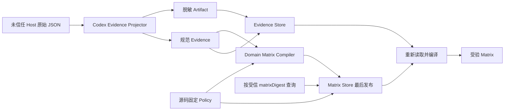

# Executor Compatibility Store 与 CLI

**状态：已实现。内容寻址 Evidence/Matrix Store、关闭式重验、生产 Composition Root 和公开 CLI 已落地；真实 v2 Host Artifact 与 Contract Evidence 仍未完成。**

## 1. 目标

本切片把已经通过平台 Projector 验证的脱敏 Evidence、固定 Policy 和 Matrix 持久化，使调用方可以在进程重启后按精确 `matrixDigest` 查询并重新证明兼容性结论。

必须满足：

- CLI 只接收原始 Prepare Manifest、Activation Plan 和 Host Result，不接收调用方自报的 `Passed Evidence`。
- Codex Projector 继续负责完整 Schema、来源摘要、项目拓扑、Host 环境和正负向检查的关闭式验证。
- Policy 由源码中的固定工厂提供，CLI 不能提交或覆盖支持 Policy。
- Artifact、Evidence 和 Matrix 使用 RFC 8785 SHA-256 内容寻址；同一摘要只能表示同一规范内容。
- Matrix 是最后发布的不可变记录；只成功写入 Artifact 或 Evidence 不能形成支持声明。
- Query 必须重新读取 Policy、Evidence 和脱敏来源 Artifact，并调用 Domain Compiler 重编译；禁止只相信已保存的 `supportLevel`。
- 不建立可变 `latest` 指针，不按 `observedAt` 自动失效或选择新旧记录。

## 2. 非目标

本切片不负责：

- 执行 Host Trust、Hook Binding、项目 `hooks.json` 写入或交互式 TUI Smoke。
- 生成 Contract Test 或 Production E2E Evidence。
- 把 `experimental` 提升为 `compatible` 或 `production`。
- 根据时间自动淘汰 Artifact。
- 实现 Claude-compatible、CatPaw 或 Generic CLI Projector。
- 将 Matrix 自动接入 G0 InstallPlan；安装前支持门在后续切片显式消费精确 `matrixDigest`。
- 为来源不可信的任意 `matrixDigest` 提供身份认证。内容寻址保证受信摘要下的完整性；跨系统真实性必须由 Human Approval、受信发布清单或后续 Attestation 绑定。
- 防御能够并发改写 Runtime Store 或其祖先目录的同一 OS 主体。该边界必须由 Store 所有权、Sandbox 或平台 ACL 保证。

## 3. 复用依据

- 现有 `CodexCompatibilityEvidenceProjectorAdapter` 继续校验 Host v2 原始来源并生成脱敏 Artifact 与规范 Evidence。
- 现有 `compileExecutorCompatibilityMatrix` 继续执行输入校验、Evidence Digest 重算、确定性编译和 Matrix 完整重验。
- `canonicalize` 与 `Rfc8785Sha256DigestAdapter` 提供跨进程稳定的 JSON 摘要。
- [`write-file-atomic`](https://github.com/npm/write-file-atomic) 提供同目录临时文件、`fsync` 和原子 Rename。
- 现有 `ExclusiveFileLockManager` 和 `FileParentDirectoryDurability` 负责跨进程互斥与父目录耐久性。
- Zod 严格 Schema 拒绝未知字段、错误枚举、非法 Digest 和损坏记录。

这些库只负责确定性序列化和文件原语。证据信任、发布顺序、重编译和 Human Gate 仍由 Harness 自己定义。

## 4. 信任链



CLI 到 Projector 的输入仍是不受信任数据。只有 Projector 成功返回后，Application 才能把 Projection 交给 Evidence Store。Application 不暴露任意 Evidence 导入 Use Case。

## 5. 分层职责

### 5.1 Domain

- 定义精确 Host Scope、Evidence、Policy、Matrix 和支持等级。
- 规范化排序并计算 Evidence、Policy 和 Matrix Digest 输入。
- 编译和重新验证 Matrix。
- 不读取文件，不识别 Codex 原始 JSON，不选择 Store 路径。

### 5.2 Application

- `CompileCodexExecutorCompatibilityUseCase` 调用 Projector、固定 Policy 和 Domain Compiler。
- 编译成功后先持久化 Projection，最后持久化 Matrix 与完整 Policy。
- `QueryExecutorCompatibilityUseCase` 按精确 Digest 加载 Matrix、Policy 和全部 Evidence，再调用 Domain Compiler 重编译。
- 任何来源、Store 或重编译失败都返回稳定错误，不输出部分成功声明。

### 5.3 Infrastructure

- Codex Projector 解释并验证平台原始来源。
- Evidence Store 保存脱敏 Artifact 和逐条规范 Evidence，并在读取时重新验证来源 Artifact Digest。
- Matrix Store 保存 Matrix 与完整 Policy，并验证两者摘要链。
- Windows、POSIX、路径大小写、符号链接和目录耐久性差异留在 Infrastructure。

### 5.4 Presentation 与 Bootstrap

- CLI 严格解析命令和 JSON 文件，不解释兼容性业务规则。
- Bootstrap 是唯一构造具体 Projector、File Store 和 Use Case 的位置。

## 6. Runtime Store 布局

```text
<storeRoot>/
  executorCompatibility/
    codex/
      <artifactDigestHex>.json
    evidence/
      <evidenceDigestHex>.json
    matrices/
      <matrixDigestHex>.json
```

`codex/<digest>.json` 与 Evidence 中的 `RuntimeStore` Locator 精确一致。每个 Artifact、Evidence 和 Matrix 文件的锁与目标文件相邻，以 `.lock` 结尾。Evidence 和 Matrix 文件都包含记录身份与规范对象；读取时必须比较路径摘要、记录摘要和对象重算摘要。

路径只能由严格的 `sha256:<64 lowercase hex>` 或已经过 Domain 安全校验的 Runtime Store Locator 派生。绝对路径、反斜杠、NUL、`.`、`..` 和操作期间已经存在或能够观察到的符号链接逃逸全部拒绝。

### 6.1 Runtime Store 信任边界

- 默认 Store 位于 `~/.liushi-harness`，目录及其祖先必须由运行 Harness 的受信 OS 主体独占。
- Repository 内容、Coding Agent 和其他不受信进程不能拥有 Store 或其祖先目录的写权限。
- `--store` 是 Human 选择的部署边界，不得指向不受信 Repository、共享临时目录或其他主体可并发改写的位置。
- 当前 Node 跨平台文件 API 不提供可同时覆盖 POSIX 与 Windows 的目录句柄相对写入；路径检查不能防御同一 OS 主体在检查与 I/O 之间恶意替换目录。
- 需要抵御同主体本地攻击者时，必须通过独立 OS 身份、Sandbox 或平台 ACL 隔离；Harness 不把协作式文件锁描述为恶意进程安全边界。

## 7. 编译协议

公开命令只接受来自受信 Compile 输出、Human Approval 或后续受信发布清单的精确摘要：

```powershell
liushi-harness executor compatibility compile `
  --executor codex `
  --prepare <prepareManifest.json> `
  --activation <activationPlan.json> `
  --result <hostResult.json> `
  [--store <path>] [--json]
```

执行顺序固定为：

1. 受限 JSON Reader 读取三份原始文档。
2. Codex Projector 完整验证来源并生成脱敏 Artifact 与 Evidence。
3. Application 使用源码固定 Policy 编译 Matrix。
4. Evidence Store 按稳定 Digest 顺序持久化 Artifact 和 Evidence。
5. Matrix Store 最后持久化 Matrix 与完整 Policy。
6. CLI 输出 Matrix Digest、精确 Scope、Profile、Support Level 和持久化处置。

Artifact 或 Evidence 已写而 Matrix 未写时，这些记录是安全的内容寻址孤儿。后续相同输入可以幂等复用；它们不能通过 Query 暴露为 Matrix 声明。

## 8. 查询协议

公开命令：

```powershell
liushi-harness executor compatibility query `
  --matrix-digest <sha256> `
  [--store <path>] [--json]
```

Query 固定执行：

1. 按 `matrixDigest` 读取 Matrix 与完整 Policy。
2. 重算 Policy Digest 和 Matrix 自身 Digest，并要求 Policy 精确匹配源码固定 Policy。
3. 按 Matrix 中的全部 `evidenceDigests` 恢复同一 Projection，并重新读取其脱敏来源 Artifact。
4. 严格校验 Codex Artifact Schema，从 Artifact 确定性重新投影 7 条 Evidence，并与持久化 Evidence 完整比对。
5. 使用源码固定 Policy 和重投影 Evidence 重新调用 Domain Compiler。
6. 只有重编译结果与持久化 Matrix 完全一致时返回 `recomputed=true`。

Matrix、Policy、Evidence 或来源 Artifact 任一缺失、篡改、Scope 漂移、投影关系漂移或摘要不一致都必须失败。Query 不选择“最新”记录，也不把多个 Scope 合并。调用方若从不可信位置取得另一个自洽摘要，Query 不会把它提升为受信身份；后续安装支持门必须把精确 `matrixDigest` 绑定进 Human Approval 或受信发布记录。

## 9. 持久化与失败语义

- 首次写入返回 `persisted`，相同内容返回 `idempotent_reuse`。
- 同一内容摘要位置出现不一致内容视为 `corrupt_store`，不是普通版本冲突。
- 调用方请求的目标 Matrix 不存在返回专用 Not Found 错误；已存在 Matrix 引用的 Evidence 缺失则视为 `corrupt_store`。
- Lock 获取失败返回资源不可用；禁止绕过 Lock 写入。
- 固定版本原子 writer 成功返回后，父目录同步或写后 Lock 释放失败，返回 `executor_compatibility_commit_outcome_unknown`；writer 自身抛错仍属于提交前失败。
- Unknown 结果禁止自动重试；调用方只能先按精确 Digest 查询现场，再决定是否重放相同输入。
- Store 不自动删除孤儿、损坏文件或遗留 Lock。

## 10. 完成门

- Unit：Projector 失败、Evidence 持久化失败、Matrix 发布顺序、Query 重编译和篡改拒绝。
- Integration：跨实例读取、跨进程 Lock、并发幂等、原子写、目录耐久性、真实链接逃逸、Golden Digest 和完整摘要链。
- CLI E2E：真实契约 Fixture 编译、二次幂等、按 Digest 查询、Not Found 与 Corrupt Store 退出码。
- Architecture：层级方向、纯 Barrel、lower camelCase、中文 TSDoc、文件与函数复杂度门全部通过。
- TypeScript 当前版本与 TypeScript 6 兼容检查、ESLint、Prettier、Build 和 Tarball Smoke 全部通过。
- 文档必须明确：缺少 Contract Evidence 和真实 v2 Host Result 时，Codex 最高仍是 `experimental`。
