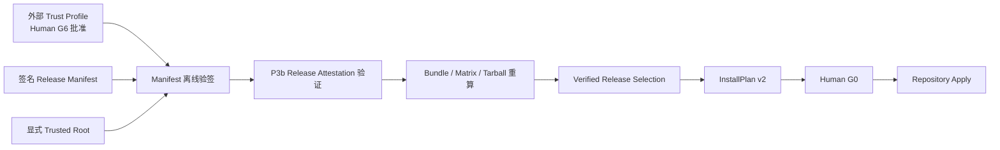

# Executor Compatibility Trusted Release

## P4c2a 状态

P4c2a 已提供包内企业 HTTPS Release Approval Authority Adapter。Adapter 只接受无凭据、无查询参数和无片段的 HTTPS endpoint，在联网前校验 Authority 输入，使用最小 canonical JSON POST，并对 JSON 回执执行严格 UTF-8、Schema、固定 Authority 标识及请求主题/摘要绑定校验；网络、重定向、超时和回执预算异常均 fail closed。P4c2b 的 Release Host、CLI 接线和真实发布流程仍未实现。

**状态：P4 技术方案已冻结，P4a Release Manifest/Consumer Trust Profile、P4b1-P4b3 的通用 Sigstore Statement、Manifest G6 Draft、包内可信 Release Approval Authority、Signed Manifest Artifact 和公开离线 Verify，P4c1 严格 Artifact Reader/create-only Writer，以及 P4c2a 企业 HTTPS Authority Adapter 已实现。** npm 根与 `HarnessApplication` 不暴露签名能力；P4c2b 隔离 Release Host 与 CLI 接线、Accepted Head、Offline Selection 和 InstallPlan v2 尚未实现。P4 不实现远端自动更新、`latest`、时间失效或完整 TUF Repository。

## 1. 目标与边界

P3b 已能证明某个 Sigstore 身份签署了绑定 Publication Bundle、npm Tarball、Executor Scope 和 G6 Approval 的 Release Attestation，但签名 Artifact 内的 Identity Policy 仍是发布者自带声明。安装端若同时从 Artifact 读取 Trusted Root 或“应该信任的身份”，会形成自认证。

P4 必须补齐以下四个独立边界：

1. 消费者通过受信通道取得并由 Human 批准 Trust Profile。
2. 选择字段进入独立、严格 Schema 的 Manifest DSSE，而不是未签名 Sidecar。
3. 离线 Verifier 按精确 Digest 验证 Manifest、Release Attestation、Bundle 和 Tarball。
4. 验证回执进入 InstallPlan 摘要，G0 只批准同一份 Release-bound Plan。

P4 不宣称离线首装能够判断“最新版本”。新环境只能信任 Trust Profile 钉住的精确 Bootstrap Manifest；已经持有受信 Head 后，才具备本地防回放能力。



## 2. 复用与不复用

| 环节                | 复用能力                                   | 边界                                                        |
| ------------------- | ------------------------------------------ | ----------------------------------------------------------- |
| JSON 规范化与摘要   | 现有 RFC 8785 Canonical JSON、SHA-256 Port | Digest 不是签名                                             |
| 严格结构校验        | Zod strict Schema                          | 原始 JSON 读取前还必须拒绝重复 Key                          |
| DSSE 签名与离线验证 | 现有 Sigstore Infrastructure               | Sigstore SDK 不进入 Domain/Application                      |
| 发布文件写入        | 现有 create-only、原子、耐久写入语义       | 为 Manifest/Attestation 新建窄 Port，不复用 Bundle 回执类型 |
| Human Approval      | 现有 G6 DecisionRequest 与 ApprovalRecord  | Authority 必须从可信源返回记录，调用方自报记录不能触发签名  |
| Repository 写入     | 现有 G0 Apply 与 Installation Revision     | G6 不能替代 G0                                              |
| 远端更新            | 后续直接采用 TUF                           | P4 不自造 Snapshot/Timestamp/过期算法                       |

`SupportedArtifact`、Task Artifact、Publication Bundle、Signed Attestation Artifact 和一次性 Verification Receipt 都不能直接充当 Release Trust Profile 或 Trusted Release Manifest。

该边界遵循两项上游安全模型：Sigstore 只证明签名来自某个数字身份，信任哪个身份仍由消费者 Policy 决定；TUF 则通过独立 Root、Targets、Snapshot 与 Timestamp 角色处理远端更新、轮换、回滚和冻结攻击。P4 复用前者完成离线身份验证，并把后者完整保留给未来远端更新，而不实现一个弱化替代品。参见 [Sigstore Threat Model](https://docs.sigstore.dev/about/threat-model/) 与 [The Update Framework Specification](https://theupdateframework.github.io/specification/)。

## 3. Consumer Trust Profile

Trust Profile 由安装组织通过源码、企业配置仓库或其他受信通道分发。它不从 Manifest、Release Artifact、npm 响应或普通项目 Wiki 自动学习。

```ts
interface ExecutorCompatibilityPublisherTrustPolicy {
  readonly schemaVersion: string;
  readonly certificateIssuer: string;
  readonly certificateIdentity: ExecutorCompatibilityPublisherCertificateIdentity;
  readonly runnerEnvironment: string;
  readonly ctLogThreshold: number;
  readonly tlogThreshold: number;
  readonly additionalCertificateExtensions: readonly ExecutorCompatibilityPublisherCertificateExtension[];
  readonly publisherTrustPolicyDigest: ContentDigest;
}

interface ExecutorCompatibilityReleaseTrustProfile {
  readonly schemaVersion: string;
  readonly profileId: string;
  readonly packageName: string;
  readonly repositoryUri: string;
  readonly target: ExecutorCompatibilityPublicationTarget;
  readonly publisherTrustPolicy: ExecutorCompatibilityPublisherTrustPolicy;
  readonly trustedRootDigest: ContentDigest;
  readonly minimumSupportLevel: ExecutorSupportLevel;
  readonly bootstrapManifestDigest: ContentDigest;
  readonly profileDigest: ContentDigest;
}
```

P3a 的 Publisher Identity Policy 会精确绑定每次发布的 Source Revision，因此 Trust Profile 不能直接钉住整个 Release-specific Policy Digest。稳定的 Publisher Trust Policy 钉住 Issuer、SAN、Workflow Identity、Runner Environment、Repository、日志阈值和额外固定 OID；Verifier 再从已签 `releaseSubject.sourceRevision` 派生本次 Source Repository Digest 扩展，重建完整 P3a Identity Policy 并要求 Digest 精确相等。这样未来 Release 只能改变签名声明已经绑定的 Source Revision，不能静默改变发布身份。

`additionalCertificateExtensions` 禁止包含 Build Signer URI、Runner Environment、Source Repository URI、Source Repository Digest 等由 Trust Profile 或 Release Subject 派生的受管 OID，并要求按 OID 稳定排序且无重复。

Trusted Root JSON 始终作为单独输入提供。Verifier 必须先重算 Root Digest 并与 Profile 精确相等，随后再使用派生的完整 Publisher Identity Policy 验证 Manifest 与 Release Attestation。Manifest 内即使出现 Root 或替代身份字段也必须因未知字段而拒绝。

首次创建、替换 Profile，或改变 Root、Issuer、SAN、Repository、Workflow、Runner Environment、固定 OID、Target、最低支持等级和 Bootstrap Manifest，均属于 G6 Human 操作。

## 4. Signed Release Manifest

每份 Manifest 只描述一个精确 Target 和一个精确 Executor Scope，不提供 fallback、通配 Scope、浮动 URL 或多候选优先级。

```ts
enum ExecutorCompatibilityReleaseArtifactKind {
  PackageTarball = "package_tarball",
  PublicationBundle = "publication_bundle",
  SignedReleaseAttestation = "signed_release_attestation",
}

interface ExecutorCompatibilityReleaseArtifactReference {
  readonly kind: ExecutorCompatibilityReleaseArtifactKind;
  readonly uri: string;
  readonly digest: ContentDigest;
  readonly byteLength: number;
}

interface ExecutorCompatibilityReleaseManifest {
  readonly schemaVersion: string;
  readonly predecessorManifestDigest?: ContentDigest;
  readonly releaseSubject: ExecutorCompatibilityReleaseSubject;
  readonly target: ExecutorCompatibilityPublicationTarget;
  readonly releaseCandidateDigest: ContentDigest;
  readonly publisherIdentityPolicyDigest: ContentDigest;
  readonly executorScope: ExecutorHostScope;
  readonly supportLevel: ExecutorSupportLevel;
  readonly matrixDigest: ContentDigest;
  readonly attestationStatementDigest: ContentDigest;
  readonly sigstoreBundleDigest: ContentDigest;
  readonly artifacts: readonly ExecutorCompatibilityReleaseArtifactReference[];
  readonly manifestDigest: ContentDigest;
}
```

Manifest Factory 必须关闭式保证：

1. 三种 Artifact Kind 各出现且只出现一次，并按固定枚举顺序规范化。
2. Package、Bundle、Matrix、Candidate、Identity、Scope 和 Support Level 与 P3b Artifact 内的已复验 Draft 精确一致。
3. Application 必须把 P3b 完整性校验结果作为外部 Binding 传入；Signed Attestation Artifact、Statement 和 Sigstore Bundle 的三项摘要必须与该 Binding 精确一致，不能使用 Manifest 自带声明替代。
4. 每个 URI 都是无凭据、Query、Fragment 和尾斜杠的规范 HTTPS 资源 URI。
5. 每个 `byteLength` 是正安全整数；P4c1 Reader 已按摘要和精确长度读取真实字节，不设置任意企业文件大小预算。
6. `manifestDigest` 排除自身后计算；未知字段、重复 Key、摘要漂移和交叉 Artifact 拼接全部拒绝，即使攻击者重算 `manifestDigest` 也不能绕过外部 Binding。

Manifest 不能只依赖 P3b Release Attestation 的签名。Manifest 自身作为新的 in-toto Statement Subject，由独立 DSSE 签名；Predicate 绑定完整 Manifest、Publisher Identity Policy 和针对 `manifestDigest` 的 G6 Approval Binding。Manifest Artifact 继续采用内容寻址和 create-only Writer。

包内发布签名链在签名 Manifest 前必须重建 P3b Signed Release Attestation，并重建针对 Manifest Digest 的 G6 DecisionRequest 与 ApprovalRecord。随后由可信 `ExecutorCompatibilityReleaseApprovalAuthorityPort` 仅按审批主题和制品摘要查询权威记录；Authority 返回的完整记录、记录摘要与内容寻址回执必须与 Draft 精确一致。调用方不能把自报的 `actor.kind=Human` 当作授权，联网 Signer 只能位于上述全部复验之后。

Authority 与 Signer 不能作为普通同进程依赖开放给不可信调用方，否则调用方可以同时伪造 Authority 并使用环境凭据。因此当前 npm 根、`HarnessApplication` 和 CLI 都不暴露 Sign UseCase、Authority 回执工厂或 Signer 注入；P4c 必须把它们放入隔离 Release Host，固定真实企业审批源和凭据，只接收 Draft 请求。

该 Authority 是发布侧认证边界，不改变离线消费者的信任模型。离线 Verifier 能证明发布者签署了包含 G6 绑定的声明，但不能独立访问或认证企业内部审批系统；消费者仍通过外部 Trust Profile、Trusted Root 和发布者身份策略决定是否信任该发布者。

## 5. 本地防回放

P4 使用签名的 `predecessorManifestDigest` 和消费者本地已接受 Head，不使用 SemVer、文件时间、签名时间或过期时间推断新鲜度。

- 没有 Head 时，只接受 Trust Profile 的 `bootstrapManifestDigest`。
- 已有 Head 时，相同 Manifest Digest 是幂等复用。
- 新 Manifest 的 `predecessorManifestDigest` 必须精确等于当前 Head。
- 旧 Manifest、分叉 Manifest、跳过前驱或缺失前驱全部关闭式拒绝。
- 降级不提供布尔 override；Human 必须创建新的 G6 Trust Profile，以新的 Bootstrap Digest 显式重建信任起点。

该机制只防止本地已经接受 Head 后的回放。远端新鲜度、冻结攻击、镜像和委托角色必须等待完整 TUF Targets/Snapshot/Timestamp。

## 6. 根与身份轮换

正常轮换不能由新 Root 自己授权。后续 Root Transition Artifact 必须同时绑定旧 Profile Digest、新 Profile Digest、旧/新 Root Digest、适用 Package/Repository/Target 和 Human G6 Approval，并由旧信任链验证后原子提交。

P4 首个生产切片在 Transition Artifact 落地前对 Root 或 Identity Digest 变化一律失败关闭。旧 Root 已不可用时，只允许独立标记、由 Human 执行的 Out-of-band Emergency Bootstrap；不得伪装成自动轮换。

## 7. Offline Verify 与 Selection

验证顺序固定为：

1. 严格读取 Trust Profile、Trusted Root、Manifest Artifact 和调用方钉住的 Manifest Digest。
2. 复验 Trust Profile 与 Trusted Root Digest，禁止任何自认证输入。
3. 从外部 Publisher Trust Policy 与签名 Release Subject 派生本次 Identity Policy，验证 Manifest DSSE 与签名声明中的 Manifest G6 Approval 绑定；不宣称离线认证企业审批源。
4. 按签名的 Digest 和 Byte Length 读取 P3b Attestation、Publication Bundle 与 Tarball。
5. 复用 P3b Offline Verifier，并要求其真实证书身份与外部 Profile 完全一致。
6. 重算 Bundle、Projection、Evidence、Policy、Matrix、Tarball 和 Manifest 的全部交叉绑定。
7. 精确匹配 Target、Executor Scope 和消费者 `minimumSupportLevel`。
8. 验证 Bootstrap 或当前受信 Head 的前驱关系。
9. 生成 `VerifiedReleaseSelection` 并持久化新的受信 Head，不修改项目 Repository。

`VerifiedReleaseSelection` 至少绑定 Profile、Root、Manifest DSSE、P3b Artifact、Bundle、Tarball、Candidate、Target、Scope、Support Level 和前驱 Head 的摘要；其自身也必须内容寻址。

## 8. InstallPlan v2

当前 InstallPlan 只绑定 Target、文件 Desired/Actual State 和 Repository Manifest，不能证明文件计划来自刚刚验证的 Release。P4 不增加可选 `releaseSelection` 字段，也不允许“验证 A、重新投影 B”。

InstallPlan v2 必须把完整 `VerifiedReleaseSelection` 或其不可变内容寻址记录纳入 `planDigest`。生产 Apply 只接受 v2；现有无 Release 来源的本地规划降级为只读 Preview，不能进入 Apply。G0 DecisionRequest 必须绑定最终 v2 `planDigest`，Apply 不联网重取任何 Release Artifact。

## 9. CLI 与 Human Gate

计划中的命令边界：

```text
attestation create   -> G6 后创建 P3b Signed Attestation Artifact
manifest create      -> 独立 G6 后创建并签名 Manifest Artifact
release verify       -> 纯离线验证，返回窄回执
init --trusted       -> Verify + Selection + InstallPlan v2，只写 Runtime Store
apply                -> Human G0 后写 Repository
```

CLI 不提供 `--latest`、`--skip-signature`、`--trust-manifest-root`、通用 `--force` 或自动降级参数。

## 10. 实现切片

1. `P4a`：Release Manifest Domain、Trust Profile Domain、严格 Schema、Digest 与单元测试。已完成。
2. `P4b1`：通用 in-toto Sigstore Statement 边界。已完成。
3. `P4b2`：Manifest 独立 G6 Draft 与 Statement Domain。已完成。
4. `P4b3`：包内可信 Release Approval Authority、Signed Manifest Artifact、Sign/Verify Use Case、公共签名面收缩与显式 Trust Profile 离线验证。已完成。
5. `P4c1`：严格 canonical Attestation/Manifest Reader、受信输出根约束下的 create-only Writer 与通用不可变文件原语。已完成，但尚未接入 CLI。
6. `P4c2a`：包内 HTTPS 企业 Authority Adapter。
7. `P4c2b`：隔离 Release Host、受控 CLI 与 Artifact I/O 接线。
8. `P4d`：Accepted Head Store、Verified Release Selection、InstallPlan v2 与 G0 Apply 迁移。
9. `P4e`：完整负向集成/E2E，包括 Root 替换、身份替换、Manifest 拼接、重复 Key、长度漂移、旧 Head 回放、分叉、首装非钉住 Digest 和无 G0 写入。

每个切片独立提交。P4 全部完成前，不宣称 Production 安装闭环。
